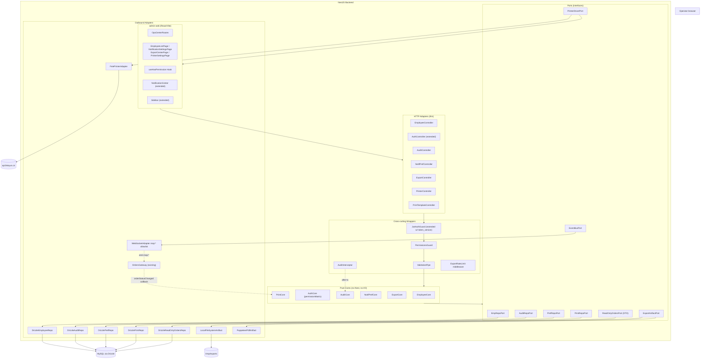

# 设计文档：商家运营中心 (merchant-ops-center)

## Overview

商家运营中心是 admin-web 中由四个子域（员工/角色管理、通知偏好、数据导出、打印设置）组成的后台运营模块。本设计采用 **Hexagonal / Ports-and-Adapters with Explicit Persistence Boundary** 架构（详见 [architecture_selection.md](./architecture_selection.md)）。每个子域被实现为一个**纯 TS Core**（业务规则）＋**RepoPort**（持久化端口）＋**DriverPort/Adapter**（外部依赖端口）的三联组合，所有数据库写入通过 `merchant-ops` 包内的 Repo 实现，严格不触碰 `OrdersService`、`CartsService`、`TablesService` 等既有业务的方法签名与事务边界（R19）。

设计的关键决策与理由：

1. **结构性零修改保证**：新模块自带专属 Repo，并仅通过只读 DTO 投影读取既有表（`orders`/`order_items`/`tables`/`dishes`/`users`），既有业务模块对本模块完全不可见，编译期即可阻断违规依赖。
2. **审计跨切关注点解耦**：`AuditInterceptor` 在 NestJS Interceptor 层捕获 `@Audit(action)` 装饰器，主事务 commit 之后再异步写库，事务回滚自动跳过（I7）。
3. **Token 失效用版本号实现**：`users.token_version` 单调递增，JwtStrategy 校验 JWT payload 中的 `token_version` 与库中是否相等；删除/禁用/重置密码/改密都自增 token_version 一次，统一一处机制完成 R5/R6 全部强制下线场景。
4. **打印机驱动可替换**：`PrinterDriverPort` 接口同时覆盖飞鹅云、浏览器 `window.print()`、未来蓝牙 SDK；`PrintCore` 不依赖具体厂商。首期 `FeiePrinterAdapter` 通过 SHA1 签名调用 `https://api.feieyun.cn/Api/Open/` 提交任务（参考[飞鹅云开放平台](https://help.feieyun.com/document.php)）。
5. **属性可测性优先**：所有 `Core` 都是无副作用的纯类，可在没有 Nest 容器、没有 MySQL 的情况下以 stub Port 注入，进而在 fast-check 中验证 I8（审计 JSON 往返）、I16（ESC/POS 模板字段往返）、I18（重试间隔单调非降）、I1/I2（Owner 数量并发不变量）、I11（权限矩阵覆盖率）等结构性不变量。

研究结论：

- **bcrypt cost ≥ 10**：Node.js 18 上 cost=10 单次哈希约 65ms，在 R20.6 限流（导出 5 次/分）与登录中间件下不会成为瓶颈。
- **AES-256-GCM**：选择 GCM 模式而非 CBC，因 GCM 自带认证标签可检测密文篡改；密钥由 `process.env.AES_KEY` 注入（32 字节十六进制），密文存储为 `iv:tag:ciphertext` 三段拼接。
- **ExcelJS streaming**：`ExcelJS.stream.xlsx.WorkbookWriter` 在 5000 行以上以增量 ZIP 写入临时文件，常驻内存稳定 < 100MB；命中 ≤5000 行时使用普通 Workbook，避免一次写盘开销（R11.4 vs R11.5）。
- **Puppeteer**：使用 `puppeteer-core` + 系统 Chromium，在 Docker 镜像中预装；HTML 模板用 Handlebars 渲染（R12.4），由前端常用的 ECharts 离屏 SSR 出图后嵌入。
- **飞鹅云 API**：所有请求 `POST application/x-www-form-urlencoded`，签名算法 `sign = SHA1(USER + UKEY + time)`；`time` 与服务器时间偏差 ≤ 600 秒；返回 JSON `{ msg, ret, data, serverExecutedTime }`，`ret = 0` 表示成功。

## Architecture



### 信息流约束

- 所有 `Core` 仅依赖自己的 Port 接口；Cores 之间**绝不互相同步调用**（DI-5）。如 `PrintCore` 需要员工昵称，通过 `EmpRepoPort.findById()` 投影读取，不调用 `EmployeeCore.someMethod()`。
- `WebSocketAdapter` 暴露 `emit(event: \`mop:${string}\`, payload)` 函数式签名，TypeScript 模板字面量类型阻止非 `mop:` 前缀字符串通过编译（I22）。
- 既有 `OrdersGateway` 不被修改；`PrintCore` 在 `onModuleInit` 注册一个被动监听器，通过 `EventBusPort.on('orderStatusChanged', handler)` 订阅，由 `WebSocketAdapter` 内部桥接（适配器层做事件订阅，不改既有事件名/payload）。
- `AuditInterceptor` 在 `@Audit(action)` 标记的 controller 处理函数 return 之后才将审计 payload 传递给 `AuditCore.write()`；当主事务回滚时，TypeORM/Drizzle 的 transaction wrapper 抛出异常，Interceptor 会跳过 audit 写入（I7、DI-3）。

## Components and Interfaces

下面所有签名都是 TypeScript 端口/类的接口形态。`Core` 类构造时只接收 Port 实例，Adapter 类构造时只接收 Drizzle/HTTP/外部 SDK 实例。

### 通用类型

```ts
// 角色集合
export type Role = 'owner' | 'manager' | 'cashier' | 'waiter' | 'admin' | 'customer';

// 审计动作枚举（必须与权限矩阵 key 1:1 对应）
export type AuditAction =
  | 'EMPLOYEE_CREATE' | 'EMPLOYEE_UPDATE' | 'EMPLOYEE_DELETE'
  | 'EMPLOYEE_UPDATE_ROLE' | 'PASSWORD_RESET' | 'PASSWORD_CHANGE'
  | 'ORDER_CHECKOUT' | 'ORDER_ADD_ITEM' | 'ORDER_REFUND'
  | 'MENU_ITEM_UPDATE'
  | 'PRINTER_CONFIG_UPDATE' | 'PRINTER_AUTO_PRINT_TOGGLE'
  | 'PRINTER_TEST' | 'PRINT_TEMPLATE_UPDATE'
  | 'EXPORT_ORDERS' | 'EXPORT_REPORT'
  | 'NOTIF_PREF_UPDATE';

export interface ActorContext {
  userId: number;
  role: Role;
  ip: string;
  userAgent: string;
  requestId: string;
}

export interface AuditPayload {
  action: AuditAction;
  targetType: string;       // e.g. 'employee', 'printer', 'template'
  targetId: string | null;  // 可为 null（如批量导出）
  before?: Record<string, unknown>;
  after?: Record<string, unknown>;
  meta?: Record<string, unknown>;
  _truncated?: boolean;     // I8 截断标记
}
```

### 1. EmployeeCore + EmployeeRepoPort

```ts
export interface EmployeeRepoPort {
  /** 行级锁读取，用于 Owner 数量不变量保护（I1/I2） */
  countActiveOwnersForUpdate(tx: Tx): Promise<number>;
  /** 软删除：status='deleted', deleted_at=now(), token_version+=1 */
  softDelete(tx: Tx, id: number): Promise<{ tokenVersion: number }>;
  /** 升级 token_version 并可选更新 status / role / nickname / password */
  update(tx: Tx, id: number, patch: EmployeePatch): Promise<EmployeeRow>;
  insert(tx: Tx, dto: NewEmployeeDto): Promise<EmployeeRow>;
  findByUsername(username: string): Promise<EmployeeRow | null>;
  findById(id: number): Promise<EmployeeRow | null>;
  list(filter: EmployeeListFilter, page: PageOptions): Promise<Page<EmployeeRow>>;
  bumpTokenVersion(tx: Tx, id: number): Promise<number>;
}

export class EmployeeCore {
  constructor(
    private readonly repo: EmployeeRepoPort,
    private readonly bus: EventBusPort,
    private readonly clock: () => Date,
    private readonly hash: (plain: string) => Promise<string>, // bcrypt cost ≥ 10
  ) {}

  async create(actor: ActorContext, dto: NewEmployeeDto): Promise<EmployeeRow>;
  async update(actor: ActorContext, id: number, patch: EmployeePatch): Promise<EmployeeRow>;
  async softDelete(actor: ActorContext, id: number): Promise<void>;
  async resetPassword(actor: ActorContext, id: number): Promise<{ tempPassword: string }>;
  async changeOwnPassword(actor: ActorContext, oldPwd: string, newPwd: string): Promise<void>;
  async list(filter: EmployeeListFilter, page: PageOptions): Promise<Page<EmployeeRow>>;

  /** 不变量校验入口（用于属性测试直接调用） */
  static checkOwnerInvariant(activeOwnerCount: number): void; // throws on <1 or >5
  static checkSelfActionRules(actor: ActorContext, target: EmployeeRow, patch: EmployeePatch): void;
  static checkPasswordPolicy(plain: string): void; // 8-64 chars, 字母+数字
  static genTempPassword(): string; // 12 字符，含数字与大小写
}
```

### 2. AuthCore + PermissionsGuard

```ts
export interface PermissionMatrix {
  /** key = AuditAction，value = 允许执行的角色集合 */
  [action: string]: ReadonlySet<Role>;
}

export class AuthCore {
  constructor(
    private readonly matrix: PermissionMatrix,
    private readonly repo: EmployeeRepoPort,
    private readonly jwt: JwtSigner,
  ) {}

  /** 启动期校验：所有挂 @Permissions 的路由必须在矩阵里有条目（I10/R1.3） */
  static validateMatrixCoverage(
    matrix: PermissionMatrix,
    declaredActions: ReadonlySet<AuditAction>,
  ): { ok: true } | { ok: false; missing: AuditAction[] };

  isAllowed(role: Role, action: AuditAction): boolean;
  signLoginToken(user: EmployeeRow): { token: string; requirePasswordChange: boolean };

  /** 用于 JwtAuthGuard 的 token_version 校验（R5.3、R5.4） */
  async verifyTokenVersion(payload: JwtPayload): Promise<EmployeeRow>;
}

@Injectable()
export class PermissionsGuard implements CanActivate {
  constructor(private readonly auth: AuthCore, private readonly reflector: Reflector) {}
  canActivate(ctx: ExecutionContext): boolean;
}

// 装饰器
export const Permissions = (action: AuditAction): MethodDecorator;
export const Roles = (...roles: Role[]): MethodDecorator;
```

### 3. AuditCore + AuditRepoPort + AuditInterceptor

```ts
export interface AuditRepoPort {
  insert(row: AuditRow): Promise<void>;
  query(filter: AuditQueryFilter, page: PageOptions): Promise<Page<AuditRow>>;
  archiveOlderThan(days: number, batch: number): Promise<{ migrated: number }>;
}

export class AuditCore {
  constructor(private readonly repo: AuditRepoPort, private readonly clock: () => Date) {}

  /** 序列化 + 8KB 截断（I8、R7.5、R7.6）。
   *  关键不变量：deserialize(serialize(payload)) deepEqual payload （round-trip）
   */
  static serializePayload(p: AuditPayload): { json: string; truncated: boolean };
  static deserializePayload(json: string): AuditPayload;

  async write(actor: ActorContext, payload: AuditPayload): Promise<void>;
  async query(filter: AuditQueryFilter, page: PageOptions): Promise<Page<AuditRow>>;
  /** 拒绝 endAt - startAt > 90 天 (I9) */
  static validateRange(startAt: Date, endAt: Date): void;
}

@Injectable()
export class AuditInterceptor implements NestInterceptor {
  constructor(private readonly core: AuditCore, private readonly reflector: Reflector) {}
  intercept(ctx: ExecutionContext, next: CallHandler): Observable<unknown>;
}

export const Audit = (action: AuditAction, opts?: AuditOpts): MethodDecorator;
```

### 4. NotifPrefCore + PrefRepoPort

```ts
export type DesktopEvent = 'NEW_ORDER' | 'ADD_ITEM' | 'REFUND';

export interface PrefRepoPort {
  getByUserId(userId: number): Promise<NotifPrefRow | null>;
  upsert(userId: number, pref: NotifPrefDto): Promise<NotifPrefRow>;
}

export class NotifPrefCore {
  constructor(private readonly repo: PrefRepoPort, private readonly soundCatalog: SoundCatalog) {}

  /** I12: desktop_events ⊆ {NEW_ORDER, ADD_ITEM, REFUND} 且 sound_id 必须在内置目录里 */
  static validate(dto: NotifPrefDto, soundCatalog: SoundCatalog): void;

  async getOrDefault(userId: number): Promise<NotifPrefRow>;
  async upsert(actor: ActorContext, dto: NotifPrefDto): Promise<NotifPrefRow>;
  async listSounds(): Promise<SoundEntry[]>;
}
```

### 5. ExportCore + ReadOnlyOrdersPort + ExportArtifactPort

```ts
export interface ReadOnlyOrdersPort {
  countOrdersInRange(f: OrderRangeFilter): Promise<number>;
  streamOrdersInRange(f: OrderRangeFilter): AsyncIterable<OrderRow>;
  aggregateDaily(date: string): Promise<DailyAggregate>;
  aggregateMonthly(month: string): Promise<MonthlyAggregate>;
}

export interface ExportArtifactPort {
  /** 同步路径：直接返回 Buffer */
  writeXlsxSync(rows: OrderRow[]): Promise<Buffer>;
  /** 异步流式路径：写入 jobId 路径下的临时文件 */
  writeXlsxStream(jobId: string, rows: AsyncIterable<OrderRow>, onProgress: (p: number) => void): Promise<string /* filePath */>;
  renderPdf(htmlPath: string, ctx: Record<string, unknown>): Promise<Buffer>;
  cleanupExpired(beforeMs: number): Promise<number>;
}

export class ExportCore {
  constructor(
    private readonly orders: ReadOnlyOrdersPort,
    private readonly artifact: ExportArtifactPort,
    private readonly jobs: ExportJobStore, // 内存 Map + 持久化进度
    private readonly clock: () => Date,
  ) {}

  /** I20: startAt < endAt 且 endAt - startAt ≤ 92 天 */
  static validateOrderRange(startAt: Date, endAt: Date): void;

  async exportOrders(actor: ActorContext, dto: ExportOrdersDto)
    : Promise<{ kind: 'sync'; buffer: Buffer; filename: string } | { kind: 'async'; jobId: string }>;
  async getJob(jobId: string): Promise<ExportJob>;
  async downloadJob(jobId: string): Promise<{ filePath: string; filename: string }>;

  async exportReport(actor: ActorContext, dto: ExportReportDto): Promise<{ buffer: Buffer; filename: string }>;
}

@Controller('merchant-ops/exports')
export class ExportController {
  @Post('orders') @Permissions('EXPORT_ORDERS') @Audit('EXPORT_ORDERS') exportOrders(@Body() dto: ExportOrdersDto, @Req() req): Promise<...>;
  @Get(':jobId')                                                       getJob(@Param('jobId') id: string): Promise<ExportJob>;
  @Get(':jobId/download')                                              download(@Param('jobId') id: string, @Res() res): Promise<void>;
  @Post('reports') @Permissions('EXPORT_REPORT') @Audit('EXPORT_REPORT') exportReport(@Body() dto: ExportReportDto, @Req() req): Promise<StreamableFile>;
}
```

### 6. PrintCore + PrintRepoPort + PrinterDriverPort + EventBusPort

```ts
export type PrinterProvider = 'FEIE' | 'BLUETOOTH' | 'BROWSER';
export type PrinterRole = 'CASHIER' | 'KITCHEN' | 'BOTH';
export type TemplateField =
  | 'STORE_NAME' | 'TABLE_NUMBER' | 'ITEMS' | 'TOTAL'
  | 'TIME' | 'ORDER_NO' | 'REMARK' | 'OPERATOR';

export interface PrintRepoPort {
  // printer_configs
  insertPrinter(tx: Tx, cfg: NewPrinterDto): Promise<PrinterRow>;
  updatePrinter(tx: Tx, id: number, patch: Partial<PrinterPatch>): Promise<PrinterRow>;
  listPrinters(): Promise<PrinterRow[]>;
  findPrinter(id: number): Promise<PrinterRow | null>;
  // print_templates
  upsertTemplate(tx: Tx, dto: TemplateDto): Promise<TemplateRow>;
  findTemplate(id: number): Promise<TemplateRow | null>;
  // print_jobs
  enqueueJob(tx: Tx, job: NewPrintJob): Promise<PrintJobRow>;
  updateJob(tx: Tx, id: number, patch: PrintJobPatch): Promise<PrintJobRow>;
  listPendingDue(now: Date, limit: number): Promise<PrintJobRow[]>;
  listRecentByPrinter(printerId: number, limit: number): Promise<PrintJobRow[]>;
  cleanupOlderThan(days: number): Promise<number>;
}

export interface PrinterDriverPort {
  /** FEIE/BROWSER 共用接口；返回 5s timeout 包裹 */
  send(cfg: PrinterRow, content: PrinterPayload, timeoutMs: number): Promise<DriverResponse>;
  queryOnline(cfg: PrinterRow): Promise<{ online: boolean; lastSeen?: Date }>;
}

export interface EventBusPort {
  /** 严格类型：只接收 mop: 前缀（I22） */
  emit<E extends `mop:${string}`>(event: E, payload: unknown): void;
  /** 订阅既有 OrdersGateway 事件名（白名单） */
  on(event: 'orderStatusChanged' | 'orderItemAdded' | 'orderRefunded', handler: (data: any) => void): () => void;
  /** 强制下线：通知 WebSocket 网关关闭 userId 对应连接 */
  forceLogout(userId: number, tokenVersion: number): void;
}

export class PrintCore {
  constructor(
    private readonly repo: PrintRepoPort,
    private readonly driver: PrinterDriverPort,
    private readonly bus: EventBusPort,
    private readonly read: ReadOnlyOrdersPort,
    private readonly clock: () => Date,
    private readonly enc: Aes256Encryptor,    // device_key 加解密
  ) {}

  // ---- 模板 ----
  /** I15: fields_json ⊇ {TABLE_NUMBER, ITEMS, TOTAL} */
  static validateTemplate(t: TemplateDto): void;
  /** I16: 渲染 ESC/POS 文本，与解析互逆 */
  static renderEscPos(template: TemplateRow, order: OrderProjection): string;
  static parseEscPosFields(escposText: string): Set<TemplateField>;
  static renderHtml(template: TemplateRow, order: OrderProjection): string;
  async previewTemplate(id: number, sampleOrder: OrderProjection)
    : Promise<{ escpos: string; html: string }>;

  // ---- 打印机配置 ----
  async upsertPrinter(actor: ActorContext, dto: NewPrinterDto | PrinterPatch): Promise<PrinterRow>;
  async listPrinters(): Promise<PrinterRow[]>;       // 不返回 device_key 明文
  async testPrint(actor: ActorContext, printerId: number): Promise<{ accepted: boolean; providerJobId?: string; errorCode?: string }>;

  // ---- 自动打印 + 重试 ----
  registerAutoPrintListener(): void; // 在 onModuleInit 调一次
  async onOrderStatusChanged(orderId: number): Promise<void>;
  /** I18: 重试调度，attempt -> nextRetryAt 单调非降 */
  static computeNextRetryAt(now: Date, attempt: 1 | 2 | 3): Date;
  /** I17: cashier=全票，kitchen=仅 ITEMS（拷贝模板时投影 fields） */
  static splitJobsByRole(printers: PrinterRow[], baseTemplate: TemplateRow): PrintPlan[];
  async runRetryTick(): Promise<void>; // cron: 每 30s 跑一次
  async listJobsByPrinter(printerId: number, limit: number): Promise<PrintJobRow[]>;
}
```

### 7. HTTP Controller 路由清单

下表的 `@Permissions` 与权限矩阵 key 必须 1:1。`@Audit` 列出对应 AuditAction。

| 控制器 | 路由 | 装饰器 | 备注 |
|---|---|---|---|
| `EmployeeController` | `GET /api/merchant-ops/employees` | `@Roles('owner')` | R2.1，分页+filter |
|  | `POST /api/merchant-ops/employees` | `@Permissions('EMPLOYEE_CREATE') @Audit('EMPLOYEE_CREATE')` | R2.2 |
|  | `PATCH /api/merchant-ops/employees/:id` | `@Permissions('EMPLOYEE_UPDATE') @Audit('EMPLOYEE_UPDATE')` | R2.4 |
|  | `DELETE /api/merchant-ops/employees/:id` | `@Permissions('EMPLOYEE_DELETE') @Audit('EMPLOYEE_DELETE')` | R2.5 |
|  | `POST /api/merchant-ops/employees/:id/reset-password` | `@Permissions('PASSWORD_RESET') @Audit('PASSWORD_RESET')` | R6.1 |
|  | `POST /api/merchant-ops/employees/me/change-password` | `@Audit('PASSWORD_CHANGE')` | R6.4，仅自己 |
| `AuditController` | `GET /api/merchant-ops/audit-logs` | `@Roles('owner','manager')` | R8.1 |
| `NotifPrefController` | `GET /api/merchant-ops/notification-preferences/me` | `@JwtAuthGuard` | R9.2 |
|  | `PUT /api/merchant-ops/notification-preferences/me` | `@Audit('NOTIF_PREF_UPDATE')` | R9.3 |
|  | `GET /api/merchant-ops/notification-preferences/sounds` | `@JwtAuthGuard` | R9.4 |
| `ExportController` | `POST /api/merchant-ops/exports/orders` | `@Permissions('EXPORT_ORDERS') @Audit('EXPORT_ORDERS')` + RateLimit(5/min) | R11 |
|  | `GET /api/merchant-ops/exports/:jobId` | `@JwtAuthGuard` | R11.6 |
|  | `GET /api/merchant-ops/exports/:jobId/download` | `@JwtAuthGuard` | R11.5 |
|  | `POST /api/merchant-ops/exports/reports` | `@Permissions('EXPORT_REPORT') @Audit('EXPORT_REPORT')` + RateLimit(5/min) | R12 |
| `PrinterController` | `POST /api/merchant-ops/printers` | `@Permissions('PRINTER_CONFIG_UPDATE') @Audit('PRINTER_CONFIG_UPDATE')` | R13.2 |
|  | `GET /api/merchant-ops/printers` | `@Roles('owner','manager')` | R13.4 |
|  | `PATCH /api/merchant-ops/printers/:id` | `@Permissions('PRINTER_CONFIG_UPDATE') @Audit('PRINTER_CONFIG_UPDATE')` | R13 |
|  | `POST /api/merchant-ops/printers/:id/test-print` | `@Permissions('PRINTER_TEST') @Audit('PRINTER_TEST')` | R15.1 |
|  | `POST /api/merchant-ops/printers/:id/auto-print` | `@Audit('PRINTER_AUTO_PRINT_TOGGLE')` | R16.4 |
|  | `GET /api/merchant-ops/printers/:id/jobs` | `@Roles('owner','manager')` | R17.7 |
| `PrintTemplateController` | `GET /api/merchant-ops/print-templates` | `@Roles('owner','manager')` | R14 |
|  | `PUT /api/merchant-ops/print-templates/:id` | `@Permissions('PRINT_TEMPLATE_UPDATE') @Audit('PRINT_TEMPLATE_UPDATE')` | R14.3 |
|  | `POST /api/merchant-ops/print-templates/:id/preview` | `@Roles('owner','manager')` | R14.4 |

### 8. admin-web 前端组件

```ts
// 路由配置（OpsCenterRoutes）
export interface OpsRoute {
  path: `/merchant-ops/${string}`;
  element: React.ReactElement;
  requiredRole: ReadonlyArray<Role>;
}
export const opsRoutes: ReadonlyArray<OpsRoute>;

// React Hook
export function useHasPermission(action: AuditAction): boolean;
export function useAuth(): { user: AuthUser | null };

// 页面组件（每个仅组合 @/components/ui/* 已有原子组件）
export function EmployeeListPage(): JSX.Element;        // 含 <EmployeeShiftSection /> 占位（R21）
export function NotificationSettingsPage(): JSX.Element;
export function ExportCenterPage(): JSX.Element;
export function PrinterSettingsPage(): JSX.Element;

// 现有组件扩展（不改文件名/签名，仅追加内部逻辑）
export interface NotificationCenterProps { /* 现有不变 */ }
// 内部读取 localStorage 'mop:notif-pref'，根据 sound_id/desktop_events 决定播放与桌面通知

export interface SidebarMenuConfig {
  primary: '运营中心';
  children: ReadonlyArray<{ to: string; label: string; visibleFor: ReadonlyArray<Role> }>;
}
```

## Data Models

### 既有表的扩展（仅 ADD COLUMN，禁止改原列）

```ts
// server/src/storage/database/shared/schema.ts 内追加（在 users 定义后）
export const users = mysqlTable(
  'users',
  {
    // ...原有字段保持原样...
    /** 强制下线版本号：登出/禁用/删除/改密时 +1 (R5.1) */
    token_version: int('token_version').notNull().default(0),
    /** 临时密码登录后必须改密 (R6.1, R6.3) */
    must_change_password: boolean('must_change_password').notNull().default(false),
    /** 账号生命周期状态，与 role 解耦：active|disabled|deleted (R2.4, R2.5) */
    status: mysqlEnum('status', ['active', 'disabled', 'deleted']).notNull().default('active'),
    /** 软删除时间戳，配合 status='deleted' (R2.5) */
    deleted_at: timestamp('deleted_at'),
  },
  (table) => [/* 既有索引保留，新增： */
    index('users_status_idx').on(table.status),
    index('users_deleted_at_idx').on(table.deleted_at),
  ],
);
```

### 新表 1：audit_logs

```ts
export const audit_logs = mysqlTable(
  'audit_logs',
  {
    id: bigint('id', { mode: 'number' }).autoincrement().primaryKey(),
    actor_user_id: int('actor_user_id'),                           // 可空：极端情况无身份
    actor_role: varchar('actor_role', { length: 20 }).notNull(),
    action: varchar('action', { length: 64 }).notNull(),           // AuditAction
    target_type: varchar('target_type', { length: 32 }).notNull(),
    target_id: varchar('target_id', { length: 64 }),
    payload_json: json('payload_json').notNull(),                  // ≤ 8KB（I8）
    ip_address: varchar('ip_address', { length: 45 }).notNull().default('unknown'),
    user_agent: varchar('user_agent', { length: 500 }).notNull().default('unknown'),
    created_at: timestamp('created_at').defaultNow().notNull(),
  },
  (t) => [
    index('audit_logs_actor_created_idx').on(t.actor_user_id, t.created_at),
    index('audit_logs_action_created_idx').on(t.action, t.created_at),
    index('audit_logs_target_idx').on(t.target_type, t.target_id),
    index('audit_logs_created_at_idx').on(t.created_at),
  ],
);
```

### 新表 2：audit_logs_archive

```ts
export const audit_logs_archive = mysqlTable(
  'audit_logs_archive',
  {
    id: bigint('id', { mode: 'number' }).primaryKey(),             // 复用主表 id
    actor_user_id: int('actor_user_id'),
    actor_role: varchar('actor_role', { length: 20 }).notNull(),
    action: varchar('action', { length: 64 }).notNull(),
    target_type: varchar('target_type', { length: 32 }).notNull(),
    target_id: varchar('target_id', { length: 64 }),
    payload_json: json('payload_json').notNull(),
    ip_address: varchar('ip_address', { length: 45 }).notNull(),
    user_agent: varchar('user_agent', { length: 500 }).notNull(),
    created_at: timestamp('created_at').notNull(),
    archived_at: timestamp('archived_at').defaultNow().notNull(),
  },
  (t) => [
    index('audit_archive_created_idx').on(t.created_at),
    index('audit_archive_action_idx').on(t.action),
  ],
);
```

### 新表 3：user_preferences

```ts
export const user_preferences = mysqlTable(
  'user_preferences',
  {
    user_id: int('user_id').primaryKey().references(() => users.id, { onDelete: 'cascade' }),
    sound_enabled: boolean('sound_enabled').notNull().default(true),
    sound_id: varchar('sound_id', { length: 64 }).notNull().default('default'),
    /** JSON 数组，元素 ⊆ {NEW_ORDER, ADD_ITEM, REFUND}（I12） */
    desktop_events: json('desktop_events').$type<DesktopEvent[]>().notNull().default(['NEW_ORDER']),
    updated_at: timestamp('updated_at').defaultNow().onUpdateNow().notNull(),
  },
);
```

### 新表 4：printer_configs

```ts
export const printer_configs = mysqlTable(
  'printer_configs',
  {
    id: int('id').autoincrement().primaryKey(),
    name: varchar('name', { length: 100 }).notNull(),
    provider: mysqlEnum('provider', ['FEIE', 'BLUETOOTH', 'BROWSER']).notNull(),
    device_sn: varchar('device_sn', { length: 64 }),
    /** AES-256-GCM 加密密文：iv:tag:ciphertext（I17、R20.4） */
    device_key_enc: varchar('device_key_enc', { length: 512 }),
    role: mysqlEnum('role', ['CASHIER', 'KITCHEN', 'BOTH']).notNull().default('BOTH'),
    enabled: boolean('enabled').notNull().default(true),
    auto_print: boolean('auto_print').notNull().default(false),
    template_id: int('template_id').references(() => print_templates.id),
    created_at: timestamp('created_at').defaultNow().notNull(),
    updated_at: timestamp('updated_at').defaultNow().onUpdateNow().notNull(),
  },
  (t) => [
    index('printer_configs_provider_idx').on(t.provider),
    index('printer_configs_enabled_idx').on(t.enabled),
    uniqueIndex('printer_configs_device_sn_uq').on(t.provider, t.device_sn),
  ],
);
```

### 新表 5：print_templates

```ts
export const print_templates = mysqlTable(
  'print_templates',
  {
    id: int('id').autoincrement().primaryKey(),
    name: varchar('name', { length: 100 }).notNull(),
    /** TemplateField[] 子集，必须包含 {TABLE_NUMBER, ITEMS, TOTAL}（I15） */
    fields_json: json('fields_json').$type<TemplateField[]>().notNull(),
    width: mysqlEnum('width', ['58mm', '80mm']).notNull().default('80mm'),
    updated_at: timestamp('updated_at').defaultNow().onUpdateNow().notNull(),
  },
);
```

### 新表 6：print_jobs

```ts
export const print_jobs = mysqlTable(
  'print_jobs',
  {
    id: bigint('id', { mode: 'number' }).autoincrement().primaryKey(),
    printer_id: int('printer_id').notNull().references(() => printer_configs.id),
    template_id: int('template_id').notNull().references(() => print_templates.id),
    /** 目标订单/样张订单的完整 PrinterPayload 投影（≤ 16KB） */
    payload_json: json('payload_json').notNull(),
    status: mysqlEnum('status', ['PENDING', 'SENT', 'SUCCESS', 'FAILED']).notNull().default('PENDING'),
    attempt: int('attempt').notNull().default(0),
    last_error: varchar('last_error', { length: 500 }),
    next_retry_at: timestamp('next_retry_at'),
    created_at: timestamp('created_at').defaultNow().notNull(),
    updated_at: timestamp('updated_at').defaultNow().onUpdateNow().notNull(),
  },
  (t) => [
    index('print_jobs_printer_status_idx').on(t.printer_id, t.status),
    index('print_jobs_next_retry_idx').on(t.status, t.next_retry_at),
    index('print_jobs_created_at_idx').on(t.created_at),
  ],
);
```

### 关键持久化策略

- 所有时间字段以 `timestamp` 存储，应用层统一以 UTC 处理。
- 写路径：`@Transactional` 包裹的 NestJS 事务包内调用 `RepoPort` 方法；`AuditCore.write` 注册到 `tx.afterCommit()` 钩子（DI-3）。如果 ORM 不支持 afterCommit，用 outbox 表 + tick 模式降级（一期不需要）。
- 主表 `audit_logs` 7 天冷数据 ≥ 90 天的部分由 cron `0 2 * * *` 拷到 `audit_logs_archive` 后删除（R8.5、R8.6）。


## Correctness Properties

*A property is a characteristic or behavior that should hold true across all valid executions of a system — essentially, a formal statement about what the system should do. Properties serve as the bridge between human-readable specifications and machine-verifiable correctness guarantees.*

下列属性均可在 fast-check (Node.js) 下以纯类构造、Stub Port 注入的方式直接验证，每条属性单测最少 100 次迭代。所有属性均通过 `Validates: Requirements ...` 注解回链至 EARS 验收条款。

### Property 1: 权限矩阵全覆盖 (matrix totality)

*For all* 由 controller 元数据扫描得到的 `declaredActions` 集合，权限矩阵 `matrix` 都必须为每一个 `action ∈ declaredActions` 提供一个非空的 `Set<Role>` 条目；并且对任意 `(role, action)`，`PermissionsGuard` 是否放行的决策必须等于 `matrix[action].has(role)`。

**Validates: Requirements 1.2, 1.3, 1.5, 1.6, 2.7, 7.3**

### Property 2: Owner 数量并发不变量 (concurrent CRUD)

*For all* 初始员工集合 `S₀` 与任意操作序列 `ops`（含创建、删除、改角色、改 status，可并发交错），在 `EmployeeCore` 通过 `EmployeeRepoPort.countActiveOwnersForUpdate` 行级锁串行化每个写操作之后，最终 `activeOwnerCount(Sₙ) ∈ [1, 5]`，并且每个操作的成功/失败结果与 "若执行后会破坏区间则拒绝" 规则一致。

**Validates: Requirements 3.1, 3.2, 3.3, 3.4**

### Property 3: 自降权与矩阵子集一致

*For all* `(currentRole, targetRole)` ∈ `Role × Role`，`EmployeeCore.checkSelfActionRules` 在 `actor.id == target.id` 且 `patch.role = targetRole` 时返回拒绝，当且仅当 `permsOf(targetRole) ⊊ permsOf(currentRole)`，其中 `permsOf(r) = { a | matrix[a].has(r) }`。

**Validates: Requirements 4.2**

### Property 4: token_version 单调非降并在敏感操作时自增

*For all* 员工 `u` 与任意 `EmployeeCore` 写操作序列 `ops`，序列中每一步之后 `u.token_version` 单调非降；且 `op` ∈ {`softDelete`, `update(status='disabled')`, `resetPassword`, `changeOwnPassword`} 时 `token_version` 严格 `+1`。同时 `JwtAuthGuard` 通过当且仅当 `payload.tokenVersion === db.tokenVersion`。

**Validates: Requirements 2.5, 5.1, 5.2, 5.3, 5.4, 6.4**

### Property 5: 密码策略

*For all* 字符串 `s ∈ string`，`EmployeeCore.checkPasswordPolicy(s)` 接受当且仅当 `8 ≤ s.length ≤ 64` 且 `s` 同时包含至少一个字母 (`[a-zA-Z]`) 与至少一个数字 (`[0-9]`)。

**Validates: Requirements 6.4**

### Property 6: 临时密码生成

*For all* 调用 `EmployeeCore.genTempPassword()` 的结果 `p`：`p.length === 12` 且 `p` 至少包含一个数字、一个字母，且 `p` 仅由 `[A-Za-z0-9]` 组成（即满足 Property 5）。

**Validates: Requirements 6.1**

### Property 7: 密码不泄漏到审计 payload

*For all* 明文密码 `pwd ∈ string` 与 `EmployeeCore.{create, resetPassword, changeOwnPassword}(pwd)` 的调用，对应写入 `AuditRepoPort.insert` 的 `AuditRow.payload_json` 经 `serialize` 后的字符串中**不**包含 `pwd` 的任何子串（长度 ≥ 4 的子串）。

**Validates: Requirements 6.6, 7.5, 20.4**

### Property 8: 审计 JSON 往返与 8KB 上限 (I8)

*For all* `AuditPayload p`，定义 `canonicalize(p)` 为 `AuditCore.serializePayload` 的截断结果再 `deserialize` 得到的对象；则 `deserializePayload(serializePayload(p).json)` 深等于 `canonicalize(p)`，并且 `serializePayload(p).json.length ≤ 8192`。当且仅当截断发生时，`canonicalize(p)._truncated === true`，且非字符串字段（`action`、`targetType`、`targetId` 等）保持原值。

**Validates: Requirements 7.5, 7.6, 7.7**

### Property 9: 审计查询区间约束

*For all* `(startAt, endAt) ∈ Date × Date`，`AuditCore.validateRange(startAt, endAt)` 接受当且仅当 `startAt < endAt` 且 `endAt - startAt ≤ 90 天 (90 * 86_400_000 ms)`。

**Validates: Requirements 8.3**

### Property 10: 审计归档划分

*For all* 审计记录集合 `R`、任意 `now`、批量大小 `B = 5000`，`AuditCore.archive(now)` 完成后：(a) 主表与归档表的并集等于 `R`；(b) 主表只剩 `created_at >= now - 180 天` 的行；(c) 单次 SQL 操作迁移行数 ≤ `B`。

**Validates: Requirements 8.5, 8.6**

### Property 11: 通知偏好校验

*For all* `(soundId ∈ string, desktopEvents ∈ string[])`，`NotifPrefCore.validate({soundId, desktopEvents}, catalog)` 接受当且仅当 `soundId ∈ catalog.ids` 且 `desktopEvents ⊆ {NEW_ORDER, ADD_ITEM, REFUND}`，且重复元素不影响接受性。

**Validates: Requirements 9.3, 10.1**

### Property 12: 通知不漏 (toast/desktop ⊥ sound)

*For all* WebSocket 事件 `e`、用户偏好 `pref`、声音通道随机故障 `soundFailed ∈ {true, false}`、桌面通知 `permission ∈ {granted, denied, default}`：当 `soundFailed = true` 时，`NotificationCenter` 仍调用 `toast(e)`，并且当 `e ∈ pref.desktop_events && permission === 'granted'` 时仍调用 `new Notification(...)`；声音失败不抑制其他通道。

**Validates: Requirements 10.2, 10.7**

### Property 13: 导出区间约束

*For all* `(startAt, endAt) ∈ Date × Date`，`ExportCore.validateOrderRange(startAt, endAt)` 接受当且仅当 `startAt < endAt` 且 `endAt - startAt ≤ 92 天`。

**Validates: Requirements 11.2**

### Property 14: 导出 audit payload 不含明细

*For all* `ExportOrdersDto / ExportReportDto` 输入，对应 `EXPORT_ORDERS` 或 `EXPORT_REPORT` 审计行的 `payload_json` 序列化字符串中不出现订单内部字段名（`dish_name`、`spec_name`、`subtotal`、`order_items`、`refund_reason`），仅包含 `{startAt, endAt, rowCount, jobId}` 或 `{type, date, rowCount}` 的允许键集合。

**Validates: Requirements 11.7, 12.8**

### Property 15: device_key 加密往返且不外泄

*For all* `key ∈ string` 写入 `printer_configs.device_key_enc`：(a) 存入数据库的密文 `enc ≠ key`；(b) `aes.decrypt(enc) === key`；(c) 任意 `PrintCore.listPrinters / findPrinter` 投影返回的对象不包含 `device_key_enc` 或其明文派生字段。

**Validates: Requirements 13.6, 20.4**

### Property 16: 打印模板字段必需且子集

*For all* `fields ∈ TemplateField[]`，`PrintCore.validateTemplate({fields_json: fields})` 接受当且仅当 `fields ⊆ {STORE_NAME, TABLE_NUMBER, ITEMS, TOTAL, TIME, ORDER_NO, REMARK, OPERATOR}` 且 `{TABLE_NUMBER, ITEMS, TOTAL} ⊆ fields`。

**Validates: Requirements 14.2, 14.3**

### Property 17: ESC/POS 模板 round-trip (I16)

*For all* 合法 `template ∈ TemplateRow`（即满足 Property 16）和 `order ∈ OrderProjection`，`parseEscPosFields(renderEscPos(template, order)) ⊇ Set(template.fields_json)`，即模板声明出现的每个字段在渲染产物中都能被解析回来。

**Validates: Requirements 14.4, 14.5**

### Property 18: 拆单角色一致性

*For all* `printers ∈ PrinterRow[]` 与 `template ∈ TemplateRow`，`PrintCore.splitJobsByRole(printers, template)` 输出的每个 `plan`：当 `plan.printer.role === 'CASHIER'` 时 `plan.fields ⊇ template.fields_json`；当 `plan.printer.role === 'KITCHEN'` 时 `plan.fields ⊆ {TABLE_NUMBER, ITEMS, ORDER_NO, REMARK, TIME}` 且 `ITEMS ∈ plan.fields`；并且 `plans.length === printers.filter(p => p.enabled && p.auto_print).length`。

**Validates: Requirements 16.1, 16.2**

### Property 19: 自动打印故障隔离

*For all* `orderId` 与任意 `PrinterDriverPort.send` 注入的异常，`PrintCore.onOrderStatusChanged(orderId)` 永远不抛出异常给调用者（既有 `OrdersGateway` 回调），失败被收敛为 `print_jobs.last_error` 与 `mop:printer-error` 事件。

**Validates: Requirements 16.5, 19.5**

### Property 20: 重试调度单调非降 (I18)

*For all* `now ∈ Date`，`PrintCore.computeNextRetryAt` 满足：
1. `computeNextRetryAt(now, 1) ≥ now + 30s`
2. `computeNextRetryAt(now, 2) ≥ computeNextRetryAt(now, 1) + (2min - 30s)`
3. `computeNextRetryAt(now, 3) ≥ computeNextRetryAt(now, 2) + (10min - 2min)`
4. 序列 `[t₁, t₂, t₃] = [computeNextRetryAt(now, 1..3)]` 单调非降。

**Validates: Requirements 17.2**

### Property 21: 派发顺序与离线暂停

*For all* `pendingJobs ∈ PrintJobRow[]` 与 `printer ∈ PrinterRow`：(a) 若 `printer.online === false`，则 `runRetryTick` 期间 `PrinterDriverPort.send` 不会被该 printer 调用；(b) 若 `printer.online === true`，则被下发的子序列等于 `pendingJobs.filter(j => j.printer_id === printer.id).sortAsc(created_at).slice(0, 50)`。

**Validates: Requirements 17.4, 17.5**

### Property 22: WebSocket 事件 mop:* 白名单 (I22)

*For all* `EventBusPort.emit(event, payload)` 调用，`event` 必须是 `\`mop:${string}\`` 字面量（TypeScript 模板字面量类型在编译期阻断，运行期 `WebSocketAdapter` 二次断言）；试图传入不以 `mop:` 起头的字符串会立即 `throw` 而**不会**触达既有 `OrdersGateway` 的事件总线。

**Validates: Requirements 19.2**

## Error Handling

### 错误响应统一格式

所有 `merchant-ops` 路由返回的错误响应符合既有 `AllExceptionsFilter` 输出契约：

```json
{ "code": <HttpStatusOrSemantic>, "msg": "<UPPER_SNAKE_CASE>", "data": null }
```

`code` 字段在 4xx/5xx 上覆盖以下语义码（与 EARS 一致）：

| 场景 | HTTP | code |
|---|---|---|
| JWT 缺失/过期 | 401 | `UNAUTHORIZED` |
| token_version 不匹配 (R5.4) | 401 | `SESSION_REVOKED` |
| 角色/权限不足 (R1.6) | 403 | `FORBIDDEN` |
| username 重复 (R2.3) | 409 | `USERNAME_TAKEN` |
| 自删 (R4.1) | 409 | `SELF_DELETE_FORBIDDEN` |
| 自降权 (R4.2) | 409 | `SELF_DEMOTE_FORBIDDEN` |
| 末位 Owner 保护 (R3.2) | 409 | `LAST_OWNER_PROTECTED` |
| Owner 上限 (R3.3) | 409 | `OWNER_LIMIT_REACHED` |
| 重置自己密码 (R6.5) | 409 | `USE_CHANGE_PASSWORD` |
| 审计区间 > 90 天 (R8.3) | 400 | `RANGE_TOO_LARGE` |
| 导出区间非法 (R11.2) | 400 | `RANGE_INVALID` |
| 模板字段不足 (R14.3) | 400 | `TEMPLATE_INVALID` |
| 通知偏好校验失败 (R9.3) | 400 | `NOTIF_PREF_INVALID` |
| 飞鹅 API 上游错误 (R13.3) | 502 | `<UPSTREAM_<原始码>>` |
| 上游打印超时 (R15.3) | 504 | `UPSTREAM_TIMEOUT` |
| Puppeteer 失败/超 60s (R12.7) | 500 | `REPORT_GENERATION_FAILED` |
| 速率限制 (R20.6) | 429 | `RATE_LIMITED` |
| DTO 校验失败 (R20.5) | 400 | `VALIDATION_FAILED` |

### 异常隔离 (R19.5)

`PrintCore.onOrderStatusChanged` 与 `ExportCore.exportOrders/exportReport` 的所有异常都在 `try/catch` 内被吞掉，仅写入结构化错误日志（pino + `requestId`），并将失败状态写入 `print_jobs.last_error` 或 `export_jobs.error_code`。这避免本模块的异常上溯到 `OrdersService.create` 或 `OrdersGateway` 的回调链路。

### 数据库事务边界

- `EmployeeCore` 的 mutation：单一 SQL 事务，包裹 `countActiveOwnersForUpdate` → `update/insert/softDelete` → `bumpTokenVersion`。
- `AuditInterceptor` 写入挂在 `tx.afterCommit()`：若主事务回滚，audit 不写入（R7.4）；若 audit 写入失败，仅记日志，不抛回主请求结果（防止"已提交但 500"）。
- `ExportCore` 异步任务运行在事务之外，使用 short-lived 流式只读连接。

### 安全相关错误

- `device_key` 解密失败 → 返回 `code: 'DEVICE_KEY_CORRUPTED'`，且不在响应中泄漏密文片段。
- `AES_KEY` 缺失或长度错误时启动期失败，配合 R20.4 的环境变量校验。
- bcrypt 比较失败：统一返回 `INVALID_CREDENTIALS`，避免基于错误码区分 "用户不存在 vs 密码错误"。

## Testing Strategy

### 测试金字塔

| 层 | 工具 | 目标对象 | 数量级 |
|---|---|---|---|
| 单元测试（example） | Jest | DTO 校验、Controller route metadata、错误码映射 | 100+ |
| 属性测试（PBT） | [fast-check](https://fast-check.dev) + Jest | 上述 22 条 Correctness Properties | 22 个 test，每个 ≥ 100 iterations |
| 集成测试 | Jest + supertest + 真实 MySQL（docker-compose） | 飞鹅 API mock、Puppeteer PDF 渲染、Excel 流式导出、审计跨切 | ≤ 30 |
| 前端测试 | React Testing Library | 路由守卫、`useHasPermission`、NotificationCenter 偏好 | ≤ 40 |
| Smoke / 启动期校验 | 启动钩子断言 | 权限矩阵覆盖、AES_KEY/FEIE_USER 必填、schema 列存在 | 5 |

### Property-Based Testing

**库选型**：`fast-check`（既已是 NestJS/TS 生态主流，与 Jest 集成简单）。所有 PBT 测试位于 `server/src/modules/merchant-ops/**/*.property.spec.ts`，命名后缀 `.property.spec.ts`。

**配置**：每个 PBT 至少 `numRuns: 100`，对涉及大输入/大集合的属性（P2、P10）使用 `numRuns: 200` 并显式 `seed` 以保证回归可复现。

**Tag 格式**：每个 PBT 测试在描述字符串中追加 `Feature: merchant-ops-center, Property N: <title>`，使失败定位可直接回链到本设计：

```ts
import fc from 'fast-check';

it('Feature: merchant-ops-center, Property 8: Audit JSON round-trip preserves canonicalized payload',
   () => fc.assert(
     fc.property(arbAuditPayload(), (p) => {
       const { json, truncated } = AuditCore.serializePayload(p);
       expect(json.length).toBeLessThanOrEqual(8192);
       const round = AuditCore.deserializePayload(json);
       const canon = canonicalize(p);
       expect(round).toEqual(canon);
       if (truncated) expect(round._truncated).toBe(true);
     }),
     { numRuns: 200 },
   ),
);
```

### 任务必含的属性测试清单

| # | 属性 | 文件 | Iter |
|---|---|---|---|
| P1  | 权限矩阵全覆盖 | `auth/permission-matrix.property.spec.ts` | 100 |
| P2  | Owner 数量并发不变量 | `employee/owner-count.property.spec.ts` | 200 |
| P8  | 审计 JSON round-trip | `audit/payload-round-trip.property.spec.ts` | 200 |
| P17 | ESC/POS 模板 round-trip | `print/escpos-template.property.spec.ts` | 200 |
| P20 | 重试调度单调非降 | `print/retry-schedule.property.spec.ts` | 100 |

（其余 P3–P22 属性各对应一个独立 spec，命名规则与上一致。）

### Generator 设计要点

- `arbAuditPayload`：随机 `action ∈ AuditAction`，random `before/after` 对象（深度 ≤ 4，含 `null/string/number/boolean/array/object`），1% 概率注入超长字符串以触发截断分支。
- `arbTemplate`：从 `TemplateField` 全集随机抽取超集 ⊇ `{TABLE_NUMBER, ITEMS, TOTAL}`，并附加随机 `width ∈ {58mm, 80mm}`。
- `arbOrder`：随机 1-30 行 `order_items`，`spec_name` 50% 概率为 null，`remark` 含中英文、emoji、换行。
- `arbOwnerOps`：在 `[create/update/delete] × [owner/manager/cashier/waiter]` 上随机生成 0–50 步操作序列，配合"乐观并发模拟器"——每个写操作前后插入 0–3 个其它操作，模拟 `SELECT FOR UPDATE` 串行化。
- `arbPrintJobBatch`：随机 `printer.online` 与 0–200 个 PENDING jobs，`created_at` 随机分布。

### Unit Tests / Example Tests

- DTO + ValidationPipe：每个 DTO 写"接受合法、拒绝多余字段、拒绝越界字段"三组示例。
- Controller metadata 静态检查：`reflect-metadata` 扫描所有 `@Controller('merchant-ops/...')` 路由，断言每个 mutation 路由都挂了 `@Audit` 与 `@Permissions / @Roles`（与 P1 互补）。
- 飞鹅签名：用文档示例（`SHA1(USER+UKEY+time)`）写黄金值单测。
- AES-256-GCM：`encrypt/decrypt` 黄金值单测 + 篡改 ciphertext 单测。

### Integration Tests

- 飞鹅 API：用 `nock` 拦截 `https://api.feieyun.cn/Api/Open/`，覆盖 `ret=0/-1/-2/-9` 四种返回。
- Puppeteer：在 CI 中跑 1 次"日报模板 → PDF 输出文件大小 < 20MB"。
- Excel 流式导出：插入 6000 条订单 → 验证生成的 `.xlsx` 行数 = 6000。
- 强制下线：登录 → 删除自己 → 复用旧 token 调任意接口 → 期望 401 + `SESSION_REVOKED`。
- 跨域读 Owner-count 锁：使用真实 MySQL 双连接并发操作，触发"两个删除同一 Owner"的竞态，断言只有一个成功。

### Smoke Tests / Startup Assertions

启动期 `onApplicationBootstrap` 钩子运行：

1. `AuthCore.validateMatrixCoverage(matrix, declaredActions)` — 缺失项 → process.exit(1) 输出列表（R1.3）。
2. `process.env.AES_KEY` 长度 == 64 hex（R20.4）。
3. `process.env.FEIE_USER` 与 `FEIE_UKEY` 非空。
4. Drizzle 检测 `users.token_version` 等 4 个新列存在；缺列阻止启动。
5. 内置音色目录 `/sounds/*.mp3` 在 TOS URL 上 HEAD 200。

### Frontend Tests

- `useHasPermission(action)`：mock auth store，覆盖 owner/manager/cashier/waiter × 5 个典型 action。
- `OpsCenterRoutes`：用 `MemoryRouter` 模拟 cashier 直访 `/merchant-ops/employees` → 期望跳转 `/forbidden`。
- `NotificationCenter`：mock `Notification.permission`，断言 sound 失败仍触发 toast（P12 的前端镜像）。
- `EmployeeListPage`：表格行渲染 + 当前用户行的"删除/降权"按钮被禁用 + tooltip 文本（R4.4）。
