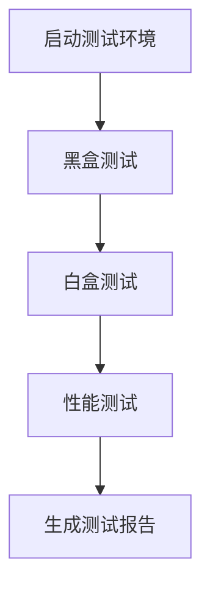

# 餐饮点餐系统测试方案

## 1. 项目概述

本项目是一个基于 Taro + NestJS 的餐饮点餐系统，包含以下核心模块：

| 模块 | 功能描述 |
|------|----------|
| **认证模块** | 用户登录、注册、微信登录、用户信息管理 |
| **菜品模块** | 菜品CRUD、分类管理、规格管理、上下架 |
| **桌台模块** | 桌台CRUD、状态管理、二维码生成 |
| **订单模块** | 订单创建、添加菜品、状态流转、加餐功能 |
| **退款模块** | 退款申请、审核处理 |
| **统计模块** | 订单统计、营收统计 |
| **打印模块** | 小票打印记录 |

---

## 2. 测试策略

### 2.1 测试覆盖范围

| 测试类型 | 覆盖内容 | 工具 |
|----------|----------|------|
| **黑盒测试** | API功能正确性、业务流程完整性 | Postman/Newman |
| **白盒测试** | 核心业务逻辑、数据处理、边界条件 | Jest |
| **性能测试** | 接口响应时间、并发处理能力 | Artillery |

### 2.2 测试环境

- **测试数据库**：使用独立的测试数据库 `test_db`
- **测试端口**：服务端运行在 `http://localhost:3001`
- **测试数据**：使用测试专用的初始化数据

---

## 3. 黑盒测试方案

### 3.1 认证模块测试

| 测试用例 | 方法 | URL | 请求体 | 预期结果 |
|----------|------|-----|--------|----------|
| 正常登录 | POST | `/api/auth/login` | `{"username": "admin", "password": "123456"}` | 返回 token，状态码 200 |
| 错误密码登录 | POST | `/api/auth/login` | `{"username": "admin", "password": "wrong"}` | 返回错误信息，状态码 401 |
| 不存在用户登录 | POST | `/api/auth/login` | `{"username": "nonexist", "password": "123456"}` | 返回错误信息，状态码 404 |
| 正常注册 | POST | `/api/auth/register` | `{"username": "test", "password": "123456"}` | 返回用户信息，状态码 200 |
| 重复用户名注册 | POST | `/api/auth/register` | `{"username": "admin", "password": "123456"}` | 返回错误信息，状态码 400 |
| 获取当前用户 | GET | `/api/auth/me` | (带有效 token) | 返回用户信息，状态码 200 |
| 无效token访问 | GET | `/api/auth/me` | (无效 token) | 返回错误信息，状态码 401 |

### 3.2 菜品模块测试

| 测试用例 | 方法 | URL | 请求体 | 预期结果 |
|----------|------|-----|--------|----------|
| 获取所有分类 | GET | `/api/dishes/categories` | - | 返回分类列表，状态码 200 |
| 创建分类 | POST | `/api/dishes/categories` | `{"name": "测试分类", "sort_order": 10}` | 返回创建的分类，状态码 200 |
| 获取所有菜品 | GET | `/api/dishes` | - | 返回菜品列表，状态码 200 |
| 按分类获取菜品 | GET | `/api/dishes?category_id=1` | - | 返回指定分类菜品，状态码 200 |
| 创建菜品 | POST | `/api/dishes` | `{"category_id": 1, "name": "测试菜品", "price": 20.00}` | 返回创建的菜品，状态码 200 |
| 获取单个菜品 | GET | `/api/dishes/:id` | - | 返回菜品详情，状态码 200 |
| 更新菜品 | PUT | `/api/dishes/:id` | `{"name": "更新菜品", "price": 25.00}` | 返回更新后的菜品，状态码 200 |
| 菜品上下架 | POST | `/api/dishes/:id/toggle` | - | 状态切换成功，状态码 200 |
| 删除菜品 | DELETE | `/api/dishes/:id` | - | 删除成功，状态码 200 |
| 添加菜品规格 | POST | `/api/dishes/specs` | `{"dish_id": 1, "spec_name": "大份", "price": 30.00}` | 返回规格信息，状态码 200 |

### 3.3 桌台模块测试

| 测试用例 | 方法 | URL | 请求体 | 预期结果 |
|----------|------|-----|--------|----------|
| 获取所有桌台 | GET | `/api/tables` | - | 返回桌台列表，状态码 200 |
| 获取桌台看板 | GET | `/api/tables/board` | - | 返回看板数据，状态码 200 |
| 创建桌台 | POST | `/api/tables` | `{"table_number": "TEST001", "capacity": 4}` | 返回创建的桌台，状态码 200 |
| 更新桌台状态 | POST | `/api/tables/:id/status` | `{"status": "occupied"}` | 状态更新成功，状态码 200 |
| 生成二维码 | POST | `/api/tables/:id/qrcode` | - | 返回二维码URL，状态码 200 |

### 3.4 订单模块测试

| 测试用例 | 方法 | URL | 请求体 | 预期结果 |
|----------|------|-----|--------|----------|
| 创建订单 | POST | `/api/orders` | `{"table_id": 1, "items": [{"dish_id": 1, "quantity": 2}]}` | 返回订单信息，状态码 200 |
| 获取订单列表 | GET | `/api/orders` | - | 返回订单列表，状态码 200 |
| 获取单个订单 | GET | `/api/orders/:id` | - | 返回订单详情，状态码 200 |
| 添加订单项 | POST | `/api/orders/:id/items` | `{"dish_id": 2, "quantity": 1}` | 添加成功，状态码 200 |
| 删除订单项 | DELETE | `/api/orders/:id/items/:itemId` | - | 删除成功，状态码 200 |
| 更新订单状态 | POST | `/api/orders/:id/status` | `{"status": "printed"}` | 状态更新成功，状态码 200 |
| 获取当前桌台订单 | GET | `/api/orders/current/:tableId` | - | 返回当前订单，状态码 200 |

### 3.5 退款模块测试

| 测试用例 | 方法 | URL | 请求体 | 预期结果 |
|----------|------|-----|--------|----------|
| 创建退款申请 | POST | `/api/refunds` | `{"order_id": 1, "amount": 20.00, "reason": "测试退款"}` | 返回退款记录，状态码 200 |
| 获取退款列表 | GET | `/api/refunds` | - | 返回退款列表，状态码 200 |
| 更新退款状态 | POST | `/api/refunds/:id/status` | `{"status": "approved"}` | 状态更新成功，状态码 200 |

---

## 4. 白盒测试方案

### 4.1 测试模块

| 模块 | 测试内容 | 文件路径 |
|------|----------|----------|
| **AuthService** | 密码加密、JWT生成、用户验证 | `server/src/modules/auth/auth.service.ts` |
| **OrdersService** | 订单创建逻辑、金额计算、状态流转 | `server/src/modules/orders/orders.service.ts` |
| **DishesService** | 菜品CRUD逻辑、分类关联 | `server/src/modules/dishes/dishes.service.ts` |
| **TablesService** | 桌台状态管理、二维码生成 | `server/src/modules/tables/tables.service.ts` |

### 4.2 单元测试用例

#### AuthService 测试

| 测试用例 | 方法 | 输入 | 预期结果 |
|----------|------|------|----------|
| 密码加密验证 | `hashPassword` | `"123456"` | 返回加密后的密码 |
| 密码比对 | `comparePassword` | `"123456", hash` | 返回 `true` |
| 密码比对失败 | `comparePassword` | `"wrong", hash` | 返回 `false` |
| JWT生成 | `generateToken` | `{userId: 1}` | 返回有效JWT |
| JWT验证 | `validateToken` | `validToken` | 返回用户ID |

#### OrdersService 测试

| 测试用例 | 方法 | 输入 | 预期结果 |
|----------|------|------|----------|
| 金额计算 | `calculateTotal` | `[{price: 10, quantity: 2}, {price: 20, quantity: 1}]` | 返回 `40.00` |
| 订单号生成 | `generateOrderNumber` | - | 返回格式正确的订单号 |
| 状态流转验证 | `updateOrderStatus` | `orderId, 'printed'` | 状态更新成功 |

---

## 5. 性能测试方案

### 5.1 测试指标

| 指标 | 目标值 |
|------|--------|
| 平均响应时间 | < 500ms |
| P95响应时间 | < 1000ms |
| 吞吐量 | > 100 req/s |
| 错误率 | < 1% |

### 5.2 测试场景

#### 场景1：高并发下单

```yaml
config:
  target: "http://localhost:3001"
  phases:
    - duration: 60
      arrivalRate: 50
      name: "持续负载"
    - duration: 60
      arrivalRate: 100
      name: "高负载"
scenarios:
  - flow:
      - post:
          url: "/api/orders"
          json:
            table_id: 1
            items:
              - dish_id: 1
                quantity: 2
```

#### 场景2：高频查询

```yaml
config:
  target: "http://localhost:3001"
  phases:
    - duration: 60
      arrivalRate: 100
      name: "查询负载"
scenarios:
  - flow:
      - get:
          url: "/api/dishes"
      - get:
          url: "/api/tables/board"
```

### 5.3 预期结果分析

| 指标 | 基准线 | 警告阈值 | 失败阈值 |
|------|--------|----------|----------|
| 响应时间(avg) | < 500ms | 500-1000ms | > 1000ms |
| 吞吐量 | > 100 req/s | 50-100 req/s | < 50 req/s |
| 错误率 | < 1% | 1-5% | > 5% |

---

## 6. 测试执行流程

### 6.1 前置条件

1. 启动测试数据库：
   ```bash
   mysql -u root -p -e "CREATE DATABASE IF NOT EXISTS test_db;"
   ```

2. 初始化测试数据：
   ```bash
   cd server && node database/init.sql
   ```

3. 启动测试服务：
   ```bash
   cd server && npm run dev -- -p 3001
   ```

### 6.2 测试执行顺序



### 6.3 测试报告内容

| 报告项 | 内容 |
|--------|------|
| 测试概述 | 测试时间、测试环境、测试范围 |
| 黑盒测试结果 | 各模块用例执行情况、通过率 |
| 白盒测试结果 | 代码覆盖率、单元测试通过率 |
| 性能测试结果 | 响应时间、吞吐量、错误率 |
| 问题汇总 | 发现的Bug、性能瓶颈 |

---

## 7. 测试工具安装

### 7.1 后端测试依赖

```bash
cd server && npm install --save-dev jest @nestjs/testing supertest
```

### 7.2 性能测试工具

```bash
npm install -g artillery
```

### 7.3 API测试工具

- **Postman**: 下载安装 [Postman](https://www.postman.com/)
- **Newman**: `npm install -g newman`

---

## 8. 测试约束

1. **禁止修改代码**：测试过程中不得修改源代码
2. **测试数据隔离**：使用独立的测试数据库，不影响生产数据
3. **测试顺序**：按黑盒→白盒→性能的顺序执行
4. **结果记录**：所有测试结果必须记录到测试报告中

---

## 9. 风险评估

| 风险 | 描述 | 应对措施 |
|------|------|----------|
| 数据库连接失败 | 测试数据库无法连接 | 确保测试数据库服务正常运行 |
| 测试数据冲突 | 并发测试导致数据不一致 | 使用事务回滚或独立测试数据 |
| 性能测试影响 | 高并发测试影响系统稳定性 | 在测试环境执行，设置资源限制 |
| 认证失效 | Token过期导致测试失败 | 测试前重新获取Token |

---

**文档版本**: v1.0  
**创建时间**: 2026-05-18  
**适用项目**: 餐饮点餐系统