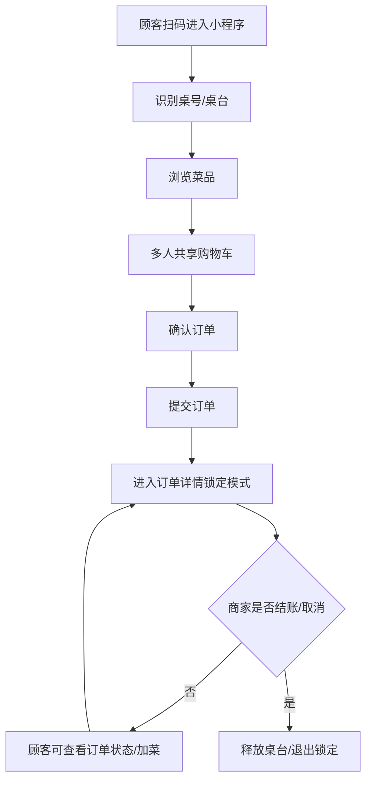
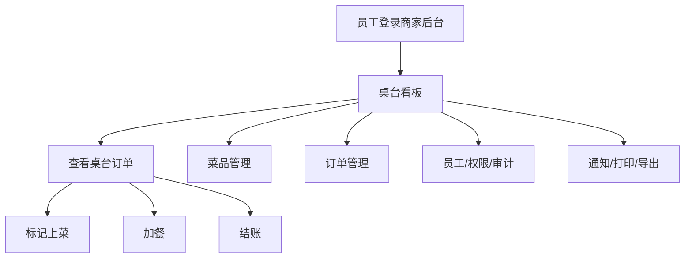
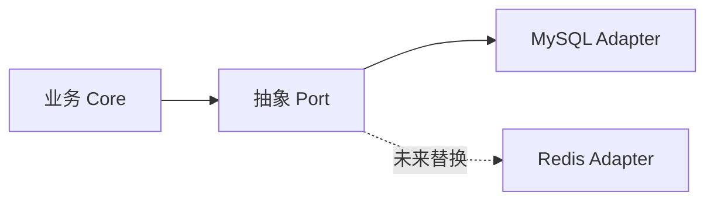

# 扫码点餐项目工程改进路线图

> 本文档用于后续系统性改进，也用于让新的 AI 智能体快速理解项目业务、现状问题、改进原则、实施优先级与验证标准。
>
> 核心原则：**保持现有业务需求、视觉体验、点餐/加菜/结账/打印/通知流程完全一致，只做底层工程、安全、可靠性、性能和可维护性增强。**

---

## 1. 项目业务背景

本项目是一个三端协同的扫码点餐系统：

```text
projects/
├── xiaochengxu/   # 微信小程序顾客端，原生 wxml/wxss/js
├── admin-web/     # 商家后台，React 18 + Vite + TailwindCSS + Zustand + axios
├── server/        # NestJS 后端，Drizzle ORM + MySQL + WebSocket
└── docs/          # 项目文档
```

### 1.1 顾客端核心业务流程



当前关键体验：

- 顾客扫码桌台进入点餐。
- 多人同桌共享购物车。
- 订单提交后进入详情页锁定模式，未完成前不能自然返回。
- 已提交订单可以继续加菜。
- 商家结账后，小程序自动释放桌台并回到首页。
- 外带模式不依赖桌台共享购物车，使用虚拟外带桌。

### 1.2 商家后台核心业务流程



当前关键体验：

- `TableBoard` 是商家日常核心入口。
- 桌台状态包括：空闲、待上菜、已上菜、已结账。
- 商家可以在桌台卡片上快速加餐、结账。
- WebSocket 推送让后台和小程序实时同步。
- 通知中心负责声音、桌面通知、toast。
- 打印模块负责自动打印、补打、试打印、打印方案。

### 1.3 运营中心业务红线

来自 `.kiro/specs/merchant-ops-center/requirements.md` 的关键约束：

> 业务零修改红线：禁止改动现有共享购物车、WebSocket、订单锁定、桌号释放等机制；只允许扩展新表和扩展用户角色，不允许重命名或删除现存字段与接口。

后续所有改进必须遵守：

- 不改变小程序视觉和交互。
- 不改变后台视觉和操作入口。
- 不改已有接口语义，除非是安全漏洞必须修。
- 优先在底层加事务、幂等、权限、审计、测试、Adapter。
- 新能力优先用 MySQL 承载，同时设计 Port，未来 Redis 可以直接替换 Adapter。

---

## 2. 当前项目现状摘要

### 2.1 技术栈

| 子系统 | 技术栈 |
|---|---|
| 小程序 | 微信小程序原生框架，wxml/wxss/js |
| 商家后台 | React 18 + Vite 5 + TailwindCSS 3 + Zustand + axios |
| 后端 | NestJS 10 + Drizzle ORM + MySQL 8 + WebSocket `ws` |
| 测试 | Vitest + fast-check 属性测试 |
| 包管理 | 根目录不安装依赖，`server/` 与 `admin-web/` 各自 npm |

### 2.2 已验证命令

最近一次评估时实际运行过：

| 命令 | 结果 |
|---|---|
| `npm --prefix server run build` | 通过 |
| `npm --prefix admin-web run build` | 通过，但 Vite 提示 chunk 过大 |
| `npm --prefix server test -- --reporter=dot` | 通过，测试日志较多导致输出截断 |
| `npm --prefix server audit --omit=dev` | 失败，当前 registry 不支持 audit endpoint |
| `npm --prefix admin-web audit --omit=dev` | 失败，当前 registry 不支持 audit endpoint |

### 2.3 代码规模

| 子系统 | 文件数 | 代码行数 |
|---|---:|---:|
| `server/src` | 141 | 19,129 |
| `admin-web/src` | 49 | 13,071 |
| `xiaochengxu` | 39 | 9,033 |
| 总计 | 229 | 41,233 |
| 测试文件 | 11 | 2,761 |

### 2.4 大文件风险

| 文件 | 行数 | 风险 |
|---|---:|---|
| `xiaochengxu/pages/order/order.js` | 1793 | 点餐页状态、请求、WS、购物车、UI 事件混在一起 |
| `admin-web/src/pages/OrderManage.tsx` | 1393 | 页面状态和业务逻辑过重 |
| `server/src/modules/merchant-ops/print/print.core.ts` | 1178 | 打印规则复杂 |
| `admin-web/src/pages/PrinterManage.tsx` | 882 | 打印机、模板、预览、任务混杂 |
| `server/src/modules/orders/orders.service.ts` | 663 | 订单事务、状态、通知混杂 |

---

## 3. 总体改进原则

### 3.1 业务行为等价

每个改动都必须满足：

| 现有行为 | 改进后要求 |
|---|---|
| 顾客扫码点餐 | 保持一致 |
| 多人共享购物车 | 保持一致 |
| 提交订单进入锁定详情 | 保持一致 |
| 顾客/商家加菜 | 保持一致 |
| 商家结账释放桌台 | 保持一致 |
| 自动打印不阻塞下单 | 保持一致 |
| 通知失败不阻塞主流程 | 保持一致 |
| 后台页面视觉 | 保持一致 |
| 小程序页面视觉 | 保持一致 |

### 3.2 MySQL 优先，Redis 预留

当前阶段暂不引入 Redis，优先用 MySQL 解决可靠性、安全和一致性问题。但设计时必须留好 Seam：



推荐预留的 Port：

| Port | 当前 MySQL 实现 | 未来 Redis 实现 |
|---|---|---|
| `IdempotencyStorePort` | `idempotency_keys` 表 | Redis `SET NX EX` |
| `CaptchaStorePort` | `captcha_tokens` 或 `ttl_kv_store` 表 | Redis TTL key |
| `RateLimitStorePort` | `rate_limit_buckets` 表或内存 + MySQL fallback | Redis sorted set / counter |
| `LoginAttemptStorePort` | `login_attempts` 或 `ttl_kv_store` 表 | Redis counter |
| `EventOutboxPort` | `event_outbox` 表 | Redis Stream / MQ |
| `DistributedLockPort` | MySQL `GET_LOCK` 或 lock table | Redis lock |

### 3.3 手术式修改

- 一次只改一个问题域。
- 不顺手改视觉、不重排页面、不重写不相关代码。
- 所有改动必须有验证命令或测试。
- P0/P1 改动优先写测试或至少补集成回归。

---

# 4. P0 改进清单：必须优先处理

P0 是生产安全和数据正确性底线。

---

## P0-1：关闭公开高权限注册漏洞

### 当前问题

位置：

- `server/src/modules/auth/auth.controller.ts`
- `server/src/modules/auth/dto/auth.dto.ts`
- `server/src/modules/auth/auth.service.ts`

当前公开接口：

```ts
@Post('register')
async register(@Body() dto: RegisterDto)
```

`RegisterDto` 允许：

```ts
@IsIn(['customer', 'admin', 'staff'])
role: string;
```

风险：外部用户可能通过公开接口注册 `admin` 或 `staff`。

### 改进目标

保持业务需求不变：

- 顾客微信登录/自动注册继续可用。
- 后台员工创建仍通过员工管理页完成。
- 不允许任何外部用户通过 `/auth/register` 创建后台角色。

### 具体改进

1. 将公开注册限制为 `customer`。
2. 如果当前业务不需要账号密码注册顾客，可直接禁用 `/auth/register`。
3. 员工、店主、经理、收银员、服务员创建统一走：
   - `POST /api/merchant-ops/employees`
4. 后台员工创建继续保持当前视觉和流程。

### 建议修改文件

- `server/src/modules/auth/dto/auth.dto.ts`
- `server/src/modules/auth/auth.service.ts`
- `server/src/modules/auth/auth.controller.ts`
- 新增测试：`server/src/modules/auth/auth.security.spec.ts`

### MySQL 方案

不需要新表。

### Redis 预留

不需要。

### 验收标准

- 未登录请求 `/api/auth/register` 且传 `role=admin`：失败或强制降级为 `customer`。
- `/api/merchant-ops/employees` 创建员工仍可用。
- 老顾客登录、微信登录不受影响。
- 有测试覆盖高权限注册拒绝。

---

## P0-2：统一后端 RBAC，修复“只有 JWT 没有权限”的接口

### 当前问题

很多敏感接口只有：

```ts
@UseGuards(JwtAuthGuard)
```

但没有 `PermissionsGuard` 或明确角色约束。

高风险模块：

- `server/src/modules/orders/orders.controller.ts`
- `server/src/modules/dishes/dishes.controller.ts`
- `server/src/modules/tables/tables.controller.ts`
- `server/src/modules/refunds/refunds.controller.ts`
- `server/src/modules/statistics/statistics.controller.ts`
- `server/src/modules/store-settings/store-settings.controller.ts`
- `server/src/modules/notif/notif.controller.ts`

前端 `RoleGuard` 只能隐藏页面，不能作为真正安全边界。

### 改进目标

保持现有后台页面和按钮行为不变，只在后端补齐权限。

### 推荐权限矩阵草案

| 操作 | owner/admin | manager | cashier | waiter | customer |
|---|---:|---:|---:|---:|---:|
| 查看桌台看板 | ✅ | ✅ | ✅ | ✅ | ❌ |
| 标记上菜 | ✅ | ✅ | ✅ | ✅ | ❌ |
| 商家加餐 | ✅ | ✅ | ✅ | 待确认 | ❌ |
| 结账 | ✅ | ✅ | ✅ | ❌ | ❌ |
| 菜品管理 | ✅ | ✅ | ❌ | ❌ | ❌ |
| 桌台管理 | ✅ | ✅ | ❌ | ❌ | ❌ |
| 退款 | ✅ | ✅ | ❌ | ❌ | ❌ |
| 统计/营业数据 | ✅ | 待确认 | ❌ | ❌ | ❌ |
| 店铺设置 | ✅ | ✅ | ❌ | ❌ | ❌ |
| 员工管理 | ✅ | ❌ | ❌ | ❌ | ❌ |
| 打印配置 | ✅ | ✅ | ❌ | ❌ | ❌ |
| 导出 | ✅ | 待确认 | ❌ | ❌ | ❌ |
| 顾客下单/加菜/查自己订单 | 按身份 | 按身份 | 按身份 | 按身份 | ✅ |

> 注意：`manager` 是否能看营业数据/导出，现有文档中有不一致表述。实现前必须和产品决策保持一致，然后固化为唯一矩阵。

### 建议新增/调整权限动作

```ts
TABLE_READ
TABLE_UPDATE
TABLE_QRCODE_GENERATE

MENU_READ
MENU_ITEM_UPDATE

ORDER_READ
ORDER_ADD_ITEM
ORDER_CHECKOUT
ORDER_MARK_SERVED
ORDER_DELETE_DRAFT

REFUND_READ
ORDER_REFUND

STATISTICS_READ

STORE_SETTINGS_UPDATE
STORE_SMTP_UPDATE

NOTIF_ROBOT_UPDATE
NOTIF_EMAIL_TEST
```

### 具体改进

1. 扩展 `AuditAction` 和 `PERMISSION_MATRIX`。
2. 给所有后台敏感接口加：
   - `@UseGuards(JwtAuthGuard, PermissionsGuard)`
   - `@Permissions('XXX')` 或 `@Roles(...)`
3. 顾客小程序接口和商家后台接口分层：
   - 顾客可用接口：下单、查自己订单、查桌台当前订单、购物车同步。
   - 商家接口：订单列表、结账、退款、统计、菜品管理、桌台管理。
4. 前端 `RoleGuard` 保持原样，只作为 UX，不作为安全依据。

### MySQL 方案

不需要新表。

### Redis 预留

不需要。

### 验收标准

- customer token 不能访问后台管理接口。
- waiter 不能结账，除非明确允许。
- cashier 可以结账和加餐。
- manager 可以管理菜品/桌台/打印。
- owner/admin 拥有最高权限。
- 每个敏感接口都有权限测试。
- 小程序点餐、查订单、加菜流程不受影响。

---

## P0-3：订单核心写入加事务

### 当前问题

`server/src/modules/orders/orders.service.ts` 中多个方法涉及多表写入，但没有统一事务。

高风险方法：

- `createOrder`
- `syncAddMore`
- `addOrderItem`
- `removeOrderItem`
- `updateOrderItemQuantity`
- `updateOrderStatus`
- `deleteOrder`

风险：

- 有订单没明细。
- 明细有了但金额没更新。
- 桌台状态和订单状态不一致。
- 订单创建成功但购物车没清理。
- 结账成功但桌台仍 occupied。

### 改进目标

业务表现不变，但数据一致性增强。

### 具体改进

1. 将纯 DB 写入放入 `db.transaction`。
2. 事务内只做数据库一致性操作。
3. 事务提交后再做：
   - WebSocket 通知
   - 打印事件
   - 邮件/群机器人通知
   - 本地文件处理
4. 如果事务失败，不发通知、不打印、不清购物车。
5. 结账时订单状态和桌台状态必须同事务。

### 推荐事务边界

#### `createOrder`

事务内：

- 创建订单。
- 插入订单明细。
- 堂食更新桌台为 occupied。
- 堂食删除当前桌台购物车。
- 创建 `event_outbox` 事件：`ORDER_CREATED`。

事务外：

- WebSocket 推送。
- 通知中心。
- 自动打印。

#### `syncAddMore`

事务内：

- 读取订单并锁定。
- 校验订单状态。
- 计算当前最大加菜轮次。
- 插入加菜明细。
- 更新订单金额。
- 创建 `event_outbox`：`ORDER_ADD_MORE`。

事务外：

- WebSocket 推送。
- 通知。
- 打印加菜单。

#### `updateOrderStatus`

事务内：

- 读取订单并锁定。
- 更新订单状态。
- 如果 settled，更新桌台 idle。
- 创建 `event_outbox`：`ORDER_SETTLED`。

事务外：

- WebSocket 推送。
- 小程序详情页自动解锁。

### MySQL 方案

直接使用 Drizzle `db.transaction`。

必要时使用：

```sql
SELECT ... FOR UPDATE
```

锁定订单行或桌台行。

### Redis 预留

不需要。

### 验收标准

- 下单成功后必须同时存在订单、明细、正确桌台状态。
- 下单失败后不能留下半截订单。
- 结账成功后订单 settled、桌台 idle 同时成立。
- 加菜成功后订单金额和明细一致。
- WebSocket/通知失败不影响已提交事务。
- 增加数据库集成测试。

---

## P0-4：订单提交、加菜、结账加入 MySQL 幂等

### 当前问题

购物车增量同步已有 `idempotencyKey`，但订单主流程没有完整幂等：

- 小程序提交订单 `/orders`
- 商家加菜 `/orders/:id/sync-add-more`
- 商家结账 `/orders/:id/status`
- 标记上菜 `/orders/:id/items/:itemId/served`
- 打印补打/试打印

用户在弱网、重复点击、请求重试时，可能产生重复订单、重复加菜、重复打印。

### 改进目标

用户视觉不变，按钮 loading 仍然保留，但后端保证重复请求安全。

### MySQL 表设计

新增表：`idempotency_keys`

```sql
CREATE TABLE idempotency_keys (
  id BIGINT PRIMARY KEY AUTO_INCREMENT,
  scope VARCHAR(64) NOT NULL,
  idempotency_key VARCHAR(128) NOT NULL,
  actor_user_id INT NULL,
  request_hash VARCHAR(64) NOT NULL,
  response_json JSON NULL,
  status VARCHAR(20) NOT NULL DEFAULT 'processing',
  locked_until TIMESTAMP NULL,
  expires_at TIMESTAMP NOT NULL,
  created_at TIMESTAMP NOT NULL DEFAULT CURRENT_TIMESTAMP,
  updated_at TIMESTAMP NOT NULL DEFAULT CURRENT_TIMESTAMP ON UPDATE CURRENT_TIMESTAMP,
  UNIQUE KEY uk_scope_key (scope, idempotency_key),
  KEY idx_expires_at (expires_at),
  KEY idx_actor_created (actor_user_id, created_at)
);
```

### Port 设计

```ts
interface IdempotencyStorePort {
  begin(scope: string, key: string, requestHash: string, actorId?: number): Promise<'started' | 'replay' | 'conflict'>;
  complete(scope: string, key: string, response: unknown): Promise<void>;
  fail(scope: string, key: string, reason: string): Promise<void>;
  getReplay(scope: string, key: string): Promise<unknown | null>;
}
```

当前 MySQL Adapter：

- `INSERT ... ON DUPLICATE KEY`
- `request_hash` 不同则返回 conflict
- `status=success` 返回上次 response
- `status=processing` 可返回 409 或等待短时间

未来 Redis Adapter：

- `SET key value NX EX`
- 成功后保存 response snapshot
- TTL 自动过期

### 接入点

| 接口 | scope |
|---|---|
| 小程序提交订单 `POST /orders` | `order:create:{tableId/userId}` |
| 商家加菜 `POST /orders/:id/sync-add-more` | `order:add-more:{orderId}` |
| 结账 `POST /orders/:id/status` | `order:status:{orderId}` |
| 标记上菜 | `order:item-served:{orderId}:{itemId}` |
| 补打 | `print:reprint:{orderId}` |
| 导出 | `export:{userId}` |

### 前端改动

不改变 UI，只是在请求头或 body 增加 key：

- 小程序 `confirm.js` 提交订单时生成 `idempotencyKey`。
- admin-web 加菜/结账时生成 `idempotencyKey`。
- 保留按钮 loading 防重复点击。

### 验收标准

- 连续点击提交订单，只产生一个订单。
- 弱网重试同一请求，返回同一个订单结果。
- 同一 key 但请求内容不同，返回 409。
- 加菜重复请求不会重复加菜。
- 结账重复请求安全返回已结账状态。
- 所有体验保持不变。

---

# 5. P1 改进清单：可靠性和长期运行能力

---

## P1-1：用 MySQL Outbox 保证通知/打印/WebSocket 事件可靠

### 当前问题

很多地方使用 fire-and-forget：

```ts
void this.notifDispatcher.notifyOrderEvent(...)
void this.markOrderAsPrinted(...)
this.ordersGateway.notifyAllAdmins(...)
```

优点是不会阻塞主流程，但风险是：

- 进程崩溃时事件丢失。
- 打印/通知失败没有统一重试。
- 事务成功但通知没发，无法补偿。
- 多实例部署时事件只在本实例内可见。

### 改进目标

保持“通知/打印失败不阻塞下单”这个业务红线，同时让事件可追踪、可重试。

### MySQL 表设计

新增表：`event_outbox`

```sql
CREATE TABLE event_outbox (
  id BIGINT PRIMARY KEY AUTO_INCREMENT,
  event_type VARCHAR(64) NOT NULL,
  aggregate_type VARCHAR(64) NOT NULL,
  aggregate_id VARCHAR(64) NOT NULL,
  payload_json JSON NOT NULL,
  status VARCHAR(20) NOT NULL DEFAULT 'pending',
  attempts INT NOT NULL DEFAULT 0,
  next_retry_at TIMESTAMP NULL,
  last_error VARCHAR(500) NULL,
  created_at TIMESTAMP NOT NULL DEFAULT CURRENT_TIMESTAMP,
  processed_at TIMESTAMP NULL,
  KEY idx_status_retry (status, next_retry_at),
  KEY idx_aggregate (aggregate_type, aggregate_id),
  KEY idx_created_at (created_at)
);
```

事务内写事件：

- `ORDER_CREATED`
- `ORDER_ADD_MORE`
- `ORDER_SETTLED`
- `ORDER_ITEM_SERVED`
- `REFUND_CREATED`
- `PRINT_JOB_CREATED`

后台 scheduler 处理：

- WebSocket 推送
- 通知派发
- 打印触发

### 未来 Redis 适配

同一个 `EventOutboxPort` 未来可改成：

- Redis Stream
- RabbitMQ
- Kafka
- BullMQ

### 验收标准

- 下单事务成功后，必有 outbox 事件。
- 通知服务挂掉时，下单仍成功。
- 服务恢复后 pending 事件继续处理。
- 同一事件不会无限重复处理。
- 后台可以查看失败事件或至少日志可追踪。

---

## P1-2：登录失败、验证码、限流从内存迁移到 MySQL Port

### 当前问题

现在有多个内存 Map：

- `AuthService.accountLockMap`
- `CaptchaService.store`
- `CartsService.recentOps`
- `RobotNotificationService.rateLimitMap`
- WebSocket IP connection count

单机没问题，但：

- 重启丢失。
- 多实例不一致。
- 难排查。
- 不利于未来扩展 Redis。

### 改进目标

当前不使用 Redis，但底层抽象好。

### Port 设计

```ts
interface TtlStorePort {
  set(key: string, value: unknown, ttlMs: number): Promise<void>;
  get<T>(key: string): Promise<T | null>;
  delete(key: string): Promise<void>;
  increment(key: string, ttlMs: number): Promise<number>;
}
```

### MySQL 表设计

```sql
CREATE TABLE ttl_kv_store (
  store_key VARCHAR(191) PRIMARY KEY,
  value_json JSON NOT NULL,
  expires_at TIMESTAMP NOT NULL,
  created_at TIMESTAMP NOT NULL DEFAULT CURRENT_TIMESTAMP,
  updated_at TIMESTAMP NOT NULL DEFAULT CURRENT_TIMESTAMP ON UPDATE CURRENT_TIMESTAMP,
  KEY idx_expires_at (expires_at)
);
```

用途：

- 验证码 token
- 登录失败次数
- 账号锁定
- 短期限流
- 临时幂等状态

### 未来 Redis 实现

完全替换 `TtlStorePort` 即可，不动业务代码。

### 验收标准

- 服务重启后账号锁定仍有效，直到 TTL 到期。
- 验证码 TTL 正常过期。
- 定时清理过期行。
- 内存 Map 使用明显减少。
- Redis 未引入，部署复杂度不变。

---

## P1-3：统一订单状态机，避免状态散落

### 当前问题

订单状态逻辑分散：

- `createOrder`
- `syncDraft`
- `syncAddMore`
- `updateOrderStatus`
- `markOrderAsPrinted`
- `deleteOrder`
- 小程序 detail 锁定逻辑
- 后台 TableBoard 状态映射

状态值包括：

- `draft`
- `submitted`
- `printed`
- `unpaid`
- `settled`
- `cancelled`
- `refunded`

部分状态在 schema 注释和业务代码中不完全一致，例如 `unpaid` 出现在查询逻辑中，但 schema 注释未完整列出。

### 改进目标

不改变现有状态含义和前端展示，只把状态流转规则集中。

### 建议新增 Module

`server/src/modules/orders/order-lifecycle.core.ts`

职责：

- 判断状态是否允许加菜。
- 判断状态是否允许结账。
- 判断状态是否允许修改上菜状态。
- 判断结账后是否释放桌台。
- 判断是否活跃订单。
- 判断顾客详情页是否锁定。

### 示例 Interface

```ts
class OrderLifecycleCore {
  static isActiveStatus(status: string): boolean;
  static canAddMore(status: string): boolean;
  static canSettle(status: string): boolean;
  static canMarkServed(status: string): boolean;
  static shouldReleaseTable(status: string): boolean;
  static nextStatusOnPrint(current: string): string;
}
```

### 验收标准

- 不改变任何前端状态显示。
- 所有订单状态判断从 Core 走。
- 增加属性测试或表格测试。
- 修复状态注释和实际代码不一致问题。
- 后续加“支付中/已支付”等状态时只改一处。

---

## P1-4：审计覆盖所有关键写操作

### 当前问题

`merchant-ops` 部分写接口已经挂 `@Audit`，但旧模块未完全覆盖。

`.kiro` 需求明确要求至少覆盖：

- 员工增删改
- 重置密码
- 菜品 CRUD
- 订单结账
- 订单加菜
- 订单退款
- 打印模板修改
- 打印机配置修改
- 订单导出
- 报表导出
- 通知偏好修改

### 改进目标

不改变业务，只补审计。

### 建议动作

| 操作 | AuditAction |
|---|---|
| 创建/修改/删除菜品 | `MENU_ITEM_UPDATE` |
| 创建/修改/删除分类 | `MENU_ITEM_UPDATE` |
| 创建/修改/删除桌台 | `TABLE_UPDATE` |
| 生成桌台二维码 | `TABLE_QRCODE_GENERATE` |
| 商家加菜 | `ORDER_ADD_ITEM` |
| 结账 | `ORDER_CHECKOUT` |
| 标记上菜 | `ORDER_MARK_SERVED` |
| 退款 | `ORDER_REFUND` |
| 修改店铺设置 | `STORE_SETTINGS_UPDATE` |
| 修改 SMTP | `STORE_SMTP_UPDATE` |
| 修改机器人配置 | `NOTIF_ROBOT_UPDATE` |

### 验收标准

- 每个关键写操作成功后有审计记录。
- 失败/回滚不写审计。
- 审计 payload 不包含密码、token、secret、webhook 明文。
- 审计查询页面继续可用。

---

## P1-5：上传安全加固，尤其 SVG

### 当前问题

上传接口允许：

```ts
svg+xml
```

同时 `/uploads` 静态公开。SVG 可携带脚本或外链，存在 XSS/钓鱼风险。

### 改进目标

保持图片上传体验不变，但降低安全风险。

### 具体改进

1. 压缩上传路径统一输出 WebP。
2. 原图直传接口禁止 SVG，或 SVG 只作为下载附件，不 inline 展示。
3. 图片 URL 校验：
   - 只允许 `/uploads/...`
   - 或对象存储白名单域名
4. 上传后记录 asset 元数据：
   - 文件名
   - mime
   - size
   - width/height
   - owner
   - created_at
5. 后续清理孤儿图片更容易。

### MySQL 表建议

```sql
CREATE TABLE image_assets (
  id BIGINT PRIMARY KEY AUTO_INCREMENT,
  url VARCHAR(500) NOT NULL,
  thumbnail_url VARCHAR(500) NULL,
  mime VARCHAR(100) NOT NULL,
  size_bytes BIGINT NOT NULL,
  width INT NULL,
  height INT NULL,
  owner_user_id INT NULL,
  usage_type VARCHAR(50) NULL,
  created_at TIMESTAMP NOT NULL DEFAULT CURRENT_TIMESTAMP,
  deleted_at TIMESTAMP NULL,
  KEY idx_owner (owner_user_id),
  KEY idx_usage (usage_type),
  KEY idx_created_at (created_at)
);
```

### Redis 预留

不需要。

### 验收标准

- 菜品图、头像上传体验不变。
- SVG 不能作为可执行内容访问。
- 上传超大图、伪造 mime、损坏图片被拒绝。
- 图片替换清理逻辑继续有效。

---

# 6. P2 改进清单：可维护性和性能

---

## P2-1：拆分大文件，但保持 UI 完全一致

### 当前大文件

| 文件 | 行数 | 问题 |
|---|---:|---|
| `xiaochengxu/pages/order/order.js` | 1793 | 点餐页状态、请求、WS、购物车、UI 事件混在一起 |
| `admin-web/src/pages/OrderManage.tsx` | 1393 | 页面状态和业务逻辑过重 |
| `server/src/modules/merchant-ops/print/print.core.ts` | 1178 | 打印规则复杂 |
| `admin-web/src/pages/PrinterManage.tsx` | 882 | 打印机、模板、预览、任务混杂 |
| `server/src/modules/orders/orders.service.ts` | 663 | 订单事务、状态、通知混杂 |

### 改进原则

只做结构拆分，不改视觉、不改交互、不改接口。

### 小程序拆分建议

从 `order.js` 中提取：

```text
pages/order/order.js                 # 只保留 Page 生命周期与 UI 事件
utils/cart-calculator.js             # totalCount/totalPrice/cartItems 计算
utils/order-ws-client.js             # WebSocket 连接、重连、订阅
utils/order-page-sync.js             # 共享购物车同步
utils/table-scan.js                  # scene/tableId 解析
```

### admin-web 拆分建议

`TableBoard.tsx`：

```text
pages/TableBoard.tsx
hooks/useTableBoard.ts
hooks/useTableOrderActions.ts
components/table-board/TableCard.tsx
components/table-board/OrderDetailModal.tsx
components/table-board/AddDishModal.tsx
components/table-board/SettleModal.tsx
```

`PrinterManage.tsx`：

```text
pages/PrinterManage.tsx
hooks/usePrinters.ts
hooks/usePrintTemplates.ts
components/printer/PrinterList.tsx
components/printer/TemplateEditDialog.tsx
components/printer/PreviewPanel.tsx
```

### 验收标准

- 页面截图无视觉差异。
- 所有原按钮和流程可用。
- 构建通过。
- 至少给抽出的纯函数加测试。
- 每次只拆一个页面，避免大爆炸改动。

---

## P2-2：admin-web 代码分割，解决大 bundle

### 当前构建结果

- 主 bundle：约 `1,010 kB`
- `heic2any` chunk：约 `1,352 kB`
- Vite 提示 chunk 过大。

### 改进目标

不改变页面视觉，只提升加载性能。

### 具体改进

1. 路由懒加载：
   - `OrderManage`
   - `PrinterManage`
   - `Statistics`
   - `DataExport`
   - `EmployeeManage`
2. `heic2any` 动态导入：
   - 只有用户上传 HEIC 时才加载。
3. Recharts 单独 chunk。
4. 打印预览/导出相关组件懒加载。

### 验收标准

- 首页/桌台看板首屏 JS 明显下降。
- 构建不再出现核心 chunk 超大，或至少主 chunk 降低。
- 所有路由正常打开。
- PWA 行为不变。

---

## P2-3：统一日志与脱敏

### 当前问题

存在多处：

```ts
console.log(...)
console.error(...)
```

可能输出：

- openid
- token
- 用户信息
- 请求 body
- webhook/secret 风险数据

### 改进目标

不改变业务，只让日志可运维、安全。

### 具体改进

1. 后端统一 Nest Logger 或 Pino。
2. 增加 requestId。
3. 日志脱敏字段：
   - `password`
   - `token`
   - `Authorization`
   - `openid`
   - `secret`
   - `webhook`
   - `device_key`
   - `smtp_pass`
4. 生产环境不打印 request body。
5. 测试环境降低打印模块噪音。

### 验收标准

- 生产日志不包含敏感明文。
- 每个 500 错误可通过 requestId 追踪。
- 测试输出不再被大量预期错误日志淹没。

---

## P2-4：依赖审计和升级流程

### 当前问题

`npm audit` 失败：

```text
registry=https://registry.npmmirror.com
[NOT_IMPLEMENTED] /-/npm/v1/security/* not implemented yet
```

### 改进目标

不改变依赖安装体验，但 CI 能做安全审计。

### 具体改进

1. 保留 `.npmrc` 使用 npmmirror。
2. 新增审计脚本使用官方 registry：

```bash
npm audit --registry=https://registry.npmjs.org --omit=dev
```

3. 增加依赖升级策略：
   - patch/minor 定期升级
   - major 单独分支验证
4. `multer@1.4.5-lts.2` 单独计划迁移 v2。
5. NestJS 10 保持稳定，后续规划 NestJS 11 升级 ADR。

### 验收标准

- CI 能跑 audit。
- 安全漏洞有明确处理流程。
- 依赖升级不再靠人工偶然发现。

---

# 7. P3 改进清单：长期扩展能力

---

## P3-1：为未来 Redis 做 Adapter 预留，但当前不引入

### 目标

现在全部用 MySQL，但代码不要写死 MySQL 细节。

### 建议新增目录

```text
server/src/modules/common/ports/
  ttl-store.port.ts
  idempotency-store.port.ts
  distributed-lock.port.ts
  event-outbox.port.ts

server/src/modules/common/adapters/mysql/
  mysql-ttl-store.adapter.ts
  mysql-idempotency-store.adapter.ts
  mysql-distributed-lock.adapter.ts
  mysql-event-outbox.adapter.ts
```

未来：

```text
server/src/modules/common/adapters/redis/
  redis-ttl-store.adapter.ts
  redis-idempotency-store.adapter.ts
  redis-distributed-lock.adapter.ts
  redis-event-stream.adapter.ts
```

### 当前 MySQL 能解决的问题

| 问题 | MySQL 当前方案 |
|---|---|
| 幂等 | 唯一索引 + 事务 |
| 验证码 TTL | `expires_at` + 定时清理 |
| 登录失败锁定 | 计数表 + expires_at |
| 分布式锁 | `GET_LOCK` 或 lock table |
| 事件可靠投递 | outbox 表 |
| 定时任务防重复 | scheduler lock 表 |
| 限流 | 小规模可用 MySQL/内存混合 |

### 未来适合 Redis 的触发条件

| 触发条件 | 建议迁移 |
|---|---|
| 多台 Node 实例同时部署 | Redis |
| WebSocket 多实例广播 | Redis Pub/Sub |
| 登录/验证码 QPS 明显上升 | Redis TTL |
| 限流成为瓶颈 | Redis counter/zset |
| 事件量高 | Redis Stream / MQ |

---

## P3-2：本地 uploads 迁移预备

### 当前问题

图片和导出文件在本地磁盘：

- 单机可以。
- 多实例不共享。
- 容器部署风险高。
- 备份恢复要额外处理。

### 当前不需要立刻迁移

但建议先抽象：

```ts
interface ObjectStoragePort {
  putObject(input): Promise<{ url: string }>;
  deleteObject(url: string): Promise<void>;
  getSignedUrl(url: string): Promise<string>;
}
```

当前 Adapter：

- `LocalObjectStorageAdapter`

未来 Adapter：

- `S3ObjectStorageAdapter`
- `AliOssObjectStorageAdapter`
- `MinioObjectStorageAdapter`

### 验收标准

- 现有 `/uploads` URL 不变。
- 业务代码不直接操作 `fs`。
- 未来迁移对象存储只替换 Adapter。

---

# 8. 测试改进清单

## T1：P0 安全集成测试

必须先补：

1. customer 不能访问后台接口。
2. 公开注册不能创建 admin/staff/owner。
3. cashier/waiter/manager 权限符合矩阵。
4. 无 token 返回 401。
5. 越权返回 403。

## T2：订单事务测试

覆盖：

1. 订单创建中插入明细失败时，不创建半截订单。
2. 结账时订单和桌台状态同事务更新。
3. 加菜时金额和明细一致。
4. 重复提交同一幂等键只生成一个订单。
5. 重复结账安全。

## T3：小程序核心流程回归清单

可先作为手动检查表，后续逐步自动化：

- 扫码桌号进入。
- 加菜到购物车。
- 多人共享购物车同步。
- 必选菜校验。
- 最少数量校验。
- 提交订单。
- 进入锁定详情。
- 商家加餐，小程序详情更新。
- 商家标记上菜，小程序详情更新。
- 商家结账，小程序自动退出锁定。
- 外带下单。
- 断网后恢复。

## T4：admin-web 回归清单

- 登录。
- token 过期跳转。
- 桌台看板加载。
- 加餐。
- 结账。
- 上菜/取消上菜。
- 菜品 CRUD。
- 桌台 CRUD。
- 员工 CRUD。
- 打印配置。
- 试打印。
- 自动打印。
- 通知偏好。
- 导出。
- 审计查询。

---

# 9. 推荐实施顺序

## 第一阶段：安全底线，不动视觉

1. `P0-1` 修复公开注册高权限漏洞。
2. `P0-2` 后端 RBAC 覆盖敏感接口。
3. 补安全集成测试。
4. 清理敏感日志。

完成标志：

- customer 不能越权后台。
- 公开接口不能创建高权限用户。
- 构建和测试通过。

## 第二阶段：订单可靠性，不动流程

1. `P0-3` 订单多表写入事务化。
2. `P0-4` 订单/加菜/结账幂等。
3. `P1-3` 抽 `OrderLifecycleCore`。
4. 补订单事务和幂等测试。

完成标志：

- 重复提交不会重复下单。
- 任意中途失败不会出现半截数据。
- 小程序和后台流程保持一致。

## 第三阶段：MySQL Outbox 和异步可靠性

1. 新增 `event_outbox`。
2. 下单、加菜、结账写事件。
3. WebSocket/通知/打印从 outbox 消费。
4. 保持 fire-and-forget 的用户体验。

完成标志：

- 通知/打印失败不影响下单。
- 失败事件可重试、可追踪。
- 为未来 Redis/MQ 做好 Seam。

## 第四阶段：内存状态 MySQL 化，Redis 预留

1. `TtlStorePort`。
2. 验证码 MySQL Adapter。
3. 登录失败锁定 MySQL Adapter。
4. 幂等 MySQL Adapter。
5. 定时清理过期数据。

完成标志：

- 重启后关键安全状态不丢。
- 未来 Redis 只需增加 Adapter。

## 第五阶段：性能和可维护性

1. admin-web 路由懒加载。
2. `heic2any` 动态导入。
3. 拆分大页面。
4. 拆分 `OrdersService`。
5. 上传安全和对象存储预备。

---

# 10. 总览清单

| 优先级 | 编号 | 改进项 | 是否改变业务 | 当前用 MySQL | Redis 预留 |
|---|---|---|---|---|---|
| P0 | 1 | 公开注册限制高权限角色 | 否 | 不需要 | 不需要 |
| P0 | 2 | 后端 RBAC 覆盖所有敏感接口 | 否 | 不需要 | 不需要 |
| P0 | 3 | 订单写入事务化 | 否 | ✅ | 不需要 |
| P0 | 4 | 订单/加菜/结账幂等 | 否 | ✅ | ✅ |
| P1 | 5 | MySQL Outbox | 否 | ✅ | ✅ |
| P1 | 6 | 登录失败/验证码 TTL Store | 否 | ✅ | ✅ |
| P1 | 7 | 订单状态机 Core | 否 | 不需要 | 不需要 |
| P1 | 8 | 审计覆盖关键写操作 | 否 | ✅ | 不需要 |
| P1 | 9 | 上传安全加固 | 否 | ✅ | 不需要 |
| P2 | 10 | 大页面拆分 | 否 | 不需要 | 不需要 |
| P2 | 11 | admin-web 代码分割 | 否 | 不需要 | 不需要 |
| P2 | 12 | 日志脱敏和 requestId | 否 | 可选 | 不需要 |
| P2 | 13 | 依赖审计流程 | 否 | 不需要 | 不需要 |
| P3 | 14 | ObjectStoragePort | 否 | 本地 Adapter | 可接 OSS/S3 |
| P3 | 15 | DistributedLockPort | 否 | MySQL lock | Redis lock |

---

# 11. 给后续 AI 智能体的执行指令

后续任何 AI 智能体接手时，请遵守：

1. **先读本文档，再读 `AGENTS.md`、`README.md`、`.kiro/specs/merchant-ops-center/*`。**
2. 不要改变现有小程序和后台视觉体验。
3. 不要改动点餐、加菜、结账、锁定详情、桌号释放的业务语义。
4. 每次只做一个阶段或一个 issue。
5. P0/P1 改动必须有测试或明确验证命令。
6. 不引入 Redis，但所有 TTL、幂等、事件、锁能力都要通过 Port 设计，当前 Adapter 用 MySQL。
7. 新增表必须走 migration。
8. 敏感字段不得进入日志、审计 payload 或前端响应。
9. 修复安全漏洞时可以调整接口拒绝逻辑，但不能破坏合法业务流程。
10. 完成每项改动后必须运行至少：
    - `npm --prefix server run build`
    - `npm --prefix server test`
    - 如涉及前端：`npm --prefix admin-web run build`

---

# 12. 建议第一批可拆 issue

1. 修复公开注册高权限漏洞。
2. 补齐后台敏感接口 RBAC。
3. 给订单创建加 MySQL 幂等键。
4. 给 `createOrder` / `syncAddMore` / `updateOrderStatus` 加事务。
5. 补对应集成测试。

这五项完成后，项目的安全和数据一致性会显著提升，同时不影响当前已经趋于完善的视觉和业务流程。
